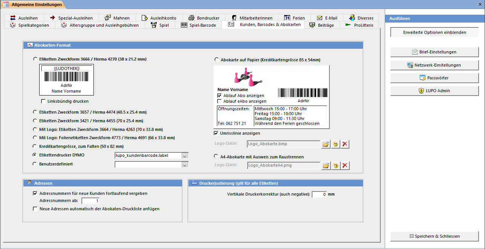

Die Kundenbarcodes können Sie entweder auf Etiketten, in Kreditkartengrösse oder auf A4-Vorlagen mit integrierter Karte (Card-in-Fold) gedruckt werden.

#### Etikettenformat

Wählen Sie das passende Etikettenformat. Oberhalb des Barcodes kann ein Text definiert werden. Dieser wird allerdings nicht bei jedem Etikettenformat ausgegeben.

#### Abokarte auf Papier

Bei den Abokarten in Kreditkartengrösse kann eine Grafik mit dem Seitenverhältnis 1:4 angezeigt werden und es stehen Ihnen zwei Textfelder zur Verfügung. Die Karten können auf handelsübliche vorperforierte A4-Bögen ausgedruckt werden.

#### Druckerjustierung

Damit der Ausdruck auf das Raster der Etiketten passt, ist es manchmal notwendig das Druckbild senkrecht zu verschieben. Tragen Sie eine positive Zahl ein, wenn der Aufdruck im Etikett oben abgeschnitten wird, eine negative wenn er zu tief ist.

Der Wert Vertikale Druckerkorrektur gilt für alle Kunden-Etiketten und Abokarten und beeinflusst den oberen Seitenrand. Für die A4-Abokarte kann zusätzlich zu dieser Einstellung noch die Y-Position des Barcodes und Kundennamens konfiguriert werden, denn je nach Fabrikat unterscheidet sich der Abstand der integrierten Karte zum unteren Seitenrand.
