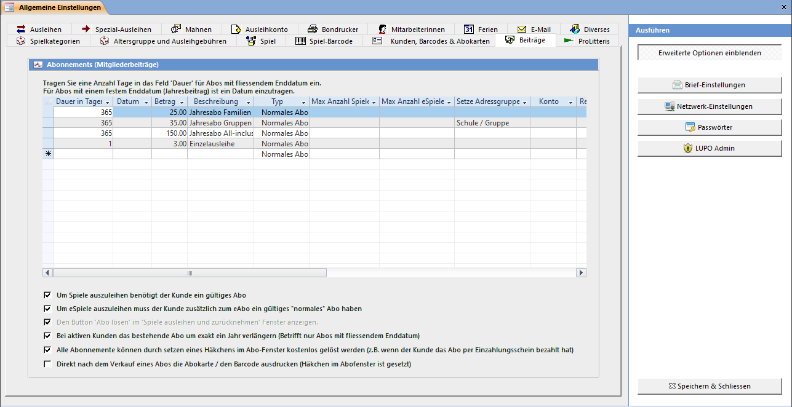

Die Art und Höhe der jährlichen Beiträge, welche von Kunden entrichtet werden müssen können Sie hier definieren.

#### Liste der Abonnaments

Es gibt grundsätzlich zwei Arten von Mitgliederbeiträgen: Abonnements mit fliessendem Enddatum und Jahresbeiträge mit festem Enddatum. Abonnements sind für eine bestimmte Dauer gültig, also von heute bis in X Tagen. Ein Jahresbeitrag-Abo ist bis zu einem bestimmten Tag (z. B. 31.12.2014) gültig. Tragen Sie in der Feld Dauer die Anzahl Tage ein, wenn es sich um ein Abo mit fliessendem Enddatum handelt. Für Abos mit festem Enddatum muss ein Datum in die Spalte Datum eingetragen werden.

Bei dem bei vielen Ludotheken unter Einzelausleihe bekannten Abo wird eine Gültigkeitsdauer von einen Tag erfasst. Ist die Anzahl der auf einmal ausgeliehenen Spiele oder eSpiele pro Kunde beschränkt, so kann dies pro Abo definiert werden.

Normalerweise werden Abo-Verkäufe auf das Konto 3000 gebucht. Soll bei einem eSpiel- oder einem Kombi-Abo ein anderes Konto verwendet werden kann dies in der entsprechenden Spalte definiert werden.

#### Gültiges Abo notwendig

Ist das Kontrollkästchen Um Spiele Auszuleihen benötigt der Kunde ein gültiges Abo deaktiviert kann der Kunde auch ohne ein gültiges Abo Spiele ausleihen.

#### eSpiele nur mit gültigem Abo

Ist die Option Um eSpiele auszuleihen muss der Kunde zusätzlich zum eAbo ein gültiges "normales" Abo haben aktiviert

#### Button Abo lösen anzeigen

Wenn kein Abo zur Ausleihe notwendig ist kann der Knopf Abo lösen im Spiele ausleihen und zurücknehmen Fenster unsichtbar gemacht werden. Werden aber zusätzlich Abos mit speziellen Konditionen (z.B. ein all Inclusive-Abo) angeboten, dann muss der Knopf sichtbar sein.

#### Abo exakt um ein Jahr verlängern

Mit aktivierter Option Bei aktiven Kunden das bestehende Abo um exakt ein Jahr verlängern werden abgelaufene Abos „rückwirkend" verlängert. Beispiel: Ein Kunde leiht am 28.02.2014 Spiele aus, zwei Tage später am 30.01.2014 endet sein Abo. Bei seinem nächsten Besuch vier Wochen später (25.02.2014) erneuert er sein Abo. Jetzt ist das Enddatum des neuen Abos nicht der 25.02.2015, sondern basierend auf dem „alten" Abo wird der 30.01.2015 berechnet.

#### Abo ohne Kosten lösen

Falls Kunden den Jahresbeitrag per Einzahlungsschein bezahlen und bei der Ausleihe die Quittung vorweisen können Sie ein Abo lösen ohne den Betrag in die Tageskasse zu buchen. Damit die Buchhaltung stimmt müssen die Einnahmen der per Überweisung bezahlten Abos manuell gebucht werden.

#### Abokarte nach Verkauf automatisch drucken

Mit dieser Option ist das Häkchen Nach dem Lösen Abokarte drucken im Abo-Fenster gesetzt. Bei DYMO LabelWriter Etiketten und bei der A4-Abokarte wird der Druck sofort gestartet, bei den anderen Etiketten wird der Kunde der Abokarten-Druckliste hinzugefügt.