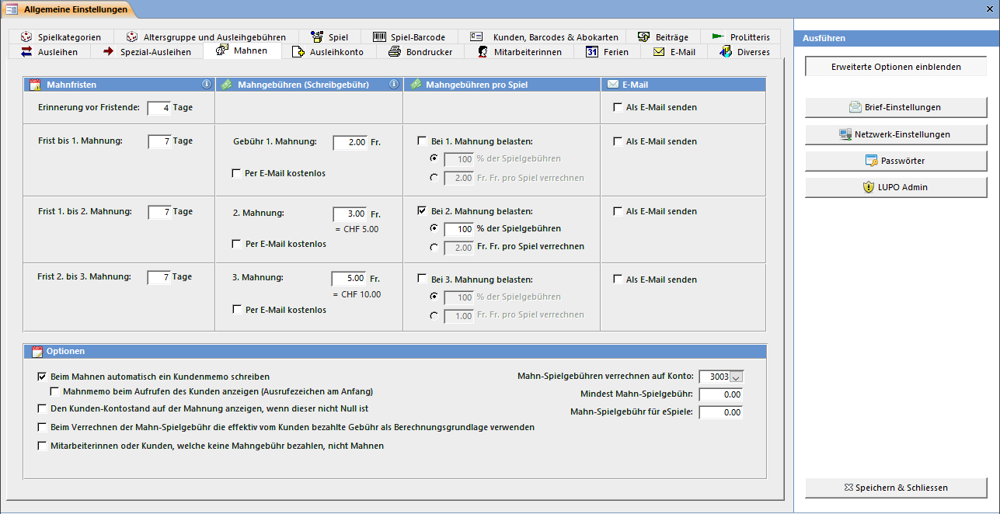

Bringt der Kunde seine Spiele bis zum Überschreiten des Mahndatums nicht zurück, so kann er gemahnt werden. Die Strafgebühr kann sich aus einer Schreibgebühr (pro Mahnung, egal wie viele und welche Spiele) und aus den Ausleih-Gebühren der säumigen Spiele berechnen. Die Einstellung für die 3. Mahnung gilt auch für die vierte und alle weiteren.

#### Mahnfristen

**Erinnerung vor Fristende:** Ist das Häkchen Als Email senden aktiviert so kann an Kunden mit einer Emailadresse eine Erinnerung gesendet werden. Es werden Spiele berücksichtigt, deren Rückgabedatum in maximal X Tagen ist und das Mahndatum noch nicht erreicht wurde.

Beispiel mit Einstellung „Erinnerung vor Fristende: 4 Tage", „Frist bis 1. Mahnung: 7 Tage": Wenn heute der 10.02.2014 ist wird für alle Spiele mit Rückgabedatum zwischen 04.02.2014 und 14.02.2014 eine Erinnerung erstellt. Spiele mit Rückgabedatum 03.02.2014 werden bereits gemahnt.

**Frist bis 1.Mahnung:** Anzahl Tage über das Rückgabedatum hinaus, bis die 1. Mahnung erstellt werden kann.

Beispiel mit Einstellung „Frist bis 1. Mahnung: 7 Tage": Ist das Rückgabedatum der 10.02.2014 werden Spiele ab dem 17.02.2014 zum Mahnen fällig.

Die neuen Mahnfristen werden immer ab dem Datum, an welchem die Mahnung erstellt wird berechnet. Ist das Datum für die erste Mahnung der 17.02.2014, der Mahnlauf wird aber erst am 20.02.2014 gestartet, so kann eine zweite Mahnung frühestens am 27.02.2014 erstellt werden (bei Frist 7 Tage).

**Frist 1. bis 2. Mahnung (2. bis 3.):** Anzahl Tage nach dem Erstellen der ersten Mahnung, bis die zweite erstellt werden kann.

#### Mahngebühren (Schreibgebühr)

Die Mahngebühren werden bei jeder Mahnung einzeln gerechnet. Also beträgt der totale Mahnbetrag der 2. Mahnung: 1. Mahnung [2.50] + 2. Mahnung [2.50] = [5.00].

#### Mahngebühren pro Spiel

Für jede Mahnstufe kann definiert werden, ob neben der Schreibgebühr auch noch eine Gebühr für die säumigen Spiele verrechnet werden soll. Beim zu belastenden Betrag kann zwischen einem Fixbetrag pro Spiel oder der Spielgebühr bzw. einem Teil davon gewählt werden (bei 50% kostet die Spielgebühr eines Fr: 2.00 Spieles noch die Hälfte, also Fr. 1.00).

#### Kundenmemo

Da dem Kunden beim Mahnen die Strafgebühren direkt auf sein Konto belastet werden, und im Ausleihfenster nicht sofort ersichtlich ist, weshalb der Kunde Schulden hat, kann automatisch ein Text in das Kundenmemo geschrieben werden.

#### Kunden-Kontostand anzeigen

Falls der Kunde noch weitere Schulden bei der Ludothek hat als nur die bereits verrechnete Mahngebühr so wird dieser Betrag auf dem Mahnbrief angezeigt.

#### Effektiv bezahlte Gebühr verrechnen

Falls Mahngebühren pro Spiel verrechnet werden, so stellt sich die Frage, ob nun die zum Spiel definierte Gebühr verrechnet werden soll oder die effektiv vom Kunden bezahlte. Die effektiv vom Kunden bezahlte Gebühr kann von der Standard-Spielgebühr abweichen, wenn sie Spezial-Ausleihen verwenden.

#### Maximal drei Mahnungen automatisch erstellen

Ist diese Option aktiviert, so wird nach der dritten Mahnung keine vierte und weitere Mahnung mehr erstellt. Das Spiel bleibt allerdings als gemahnt in der Liste.

#### MitarbeiterInnen oder Kunden nicht Mahnen

Mitarbeiterinnen oder Kunden, bei denen Keine Mahngebühr verrechnen gesetzt ist, werden nicht gemahnt. Die Adresse erscheint dennoch in der Mahnliste des Mahnen-Fensters, hat aber das Häkchen Nicht Mahnen gesetzt. Um einem solchen Kunden auf Wunsch trotzdem eine Mahnung zuzustellen, kann vor dem Verrechnen der Gebühren das Häkchen entfernt werden.

#### Konto für Spiel-Mahngebühren

Es kann definiert werden ob zusätzlich mit der Mahnung verrechneten Spielgebühren auf das Ausleihkonto oder das Mahnkonto verbucht werden.

#### Mindest-Mahn-Spielgebühr

Wird pro verspätetem Spiel eine Gebühr erhoben kann ein minimal-Betrag definiert werden. So ist es möglich, wenn z.B. bei der zweiten Mahnung 50% der Spielgebühren zu verlangt werden, für Spiele mit einer Ausleihgebühr von Fr. 1.- anstelle von 50 Rappen den Betrag von Fr. 1.- zu verrechnen.

#### Mahn-Spielgebühr für eSpiele

Da bei eSpielen keine Ausleihgebühr verlangt werden darf kann ein Fixbetrag pro verspätetem eSpiel verrechnet werden.