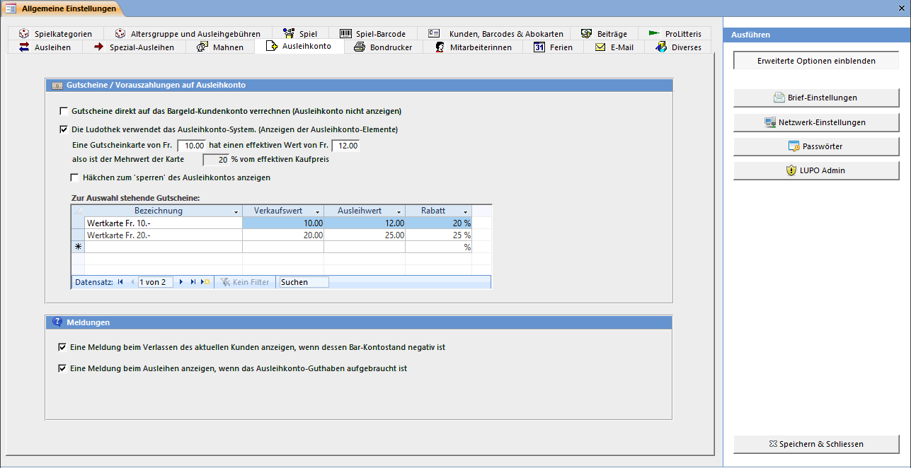

Gutschriftenkarten können verwendet werden, wenn auf im Voraus bezahlte Ausleihgebühren ein Rabatt gewährt werden soll oder wenn ein Kunde einen Geschenkgutschein der Ludo einlösen will.

#### Gutschriftenkarte

Jeder Kunde hat sein 'normales' Konto und ein Gutschriften-Konto für Ausleihgebühren. Das Gutschriften-Konto wird solange mit den Ausleihgebühren belastet bis es aufgebraucht (0) ist. Kauft ein Kunde eine Gutschriftenkarte, so leistet er eine Vorauszahlung für die Ausleihgebühren. Eine Gutschriftenkarte ist unpersönlich solange sie nicht eingelöst wurde.

Ist das Häkchen bei Die Ludothek verwendet das Gutschriftenkarten-System. (Anzeigen der GS-Elemente) nicht gesetzt, so sind die Knöpfe zum Verkauf und Einlösen von Gutschriften im Ausleihen-Fenster nicht sichtbar.

#### Meldung "Negativer Bar-Kontostand"

Ist das Kontrollkästchen abgewählt, erscheint im Ausleihen-Fenster beim Kundenwechsel eine Meldung (natürlich nur dann, wenn der Kunde auch Schulden hat).

#### Meldung "Gutschriftenkonto aufgebraucht"

Ist das Kontrollkästchen Eine Meldung beim Ausleihen anzeigen wenn das Ausleihkonto aufgebraucht ist angekreuzt, stoppt das Programm die Ausleihe und fragt, ob noch eine Gutschriftenkate verkauft werden soll:

