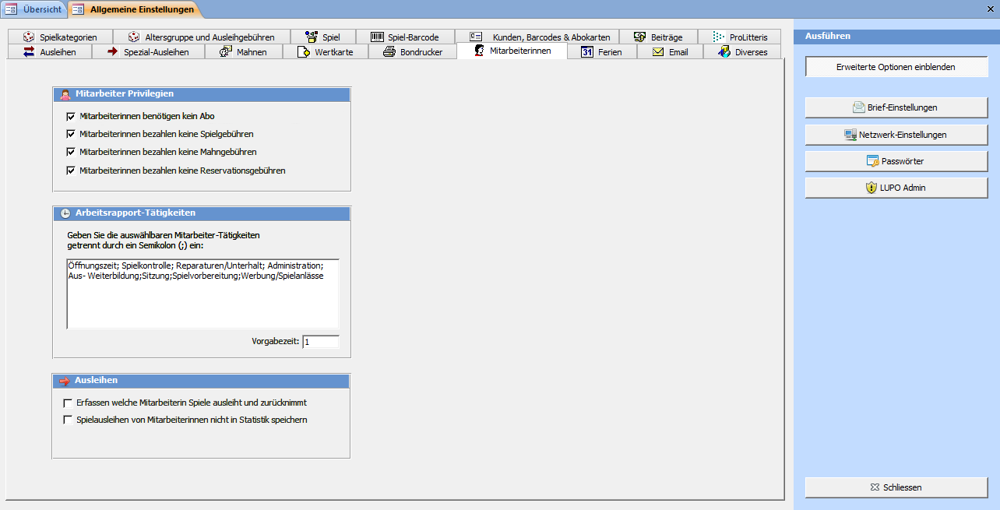

Als Mitarbeiterinnen gelten Adressen, bei welchen das Häkchen Mitarbeiterin gesetzt ist.

#### Mitarbeiter benötigen kein Abo

Ist das Häkchen gesetzt, können Mitarbeiter auch dann Spiele ausleihen, wenn ihr Abo abgelaufen ist.

#### Mitarbeiter bezahlen keine Spielgebühren

Den Mitarbeitern wird beim Ausleihen eines Spiels keine Gebühr verrechnet.

#### Mitarbeiter bezahlen keine Mahngebühren

Mahnungen werden auch für Mitarbeiter erstellt. Ist jedoch das Kontrollkästchen aktiviert, wird dem Mitarbeiter keine Schreib- und Mahn-Spielgebühr verrechnet.

#### Mitarbeiter bezahlen keine Reservationsgebühren

Der Mitarbeiterin wird weder beim Ausleihen noch beim Reservieren eine Reservationsgebühr verrechnet.

#### Arbeitsrapport-Tätigkeiten

Die hier eingetragenen Tätigkeiten können im Fenster zum Erfassen der Arbeitszeiten ausgewählt werden. Einzelne Einträge werden mit einem Semikolon (;) voneinander getrennt.

Als Arbeitszeit in Stunden wird im Feld Vorgabezeit definierte Zahl vorgeschlagen.

 
>>>>> Beim Erfassen der Tätigkeiten kann nicht nur ein vordefinierter Text gewählt werden, sondern es be-steht auch die Möglichkeit einen freien Text einzutragen. Beachten Sie jedoch, dass eine statistische Auswertung besser gelingt, wenn einheitliche Texte verwendet werden.

#### MitarbeiterIn erfassen

Bei Spielbewegungen und Buchungen wird die den Computer bedienende Mitarbeiterin erfasst. Ist das Häkchen nicht aktiviert, dann kann trotzdem im Ausleihfenster die arbeitende Mitarbeiterin bestimmt werden.

#### Ausleihen nicht in Statistik speichern

Ist diese Option aktiviert werden Spielausleihen von Mitarbeiterinnen bei der Rückgabe komplett gelöscht und sind somit später in keiner Statistik ersichtlich.
