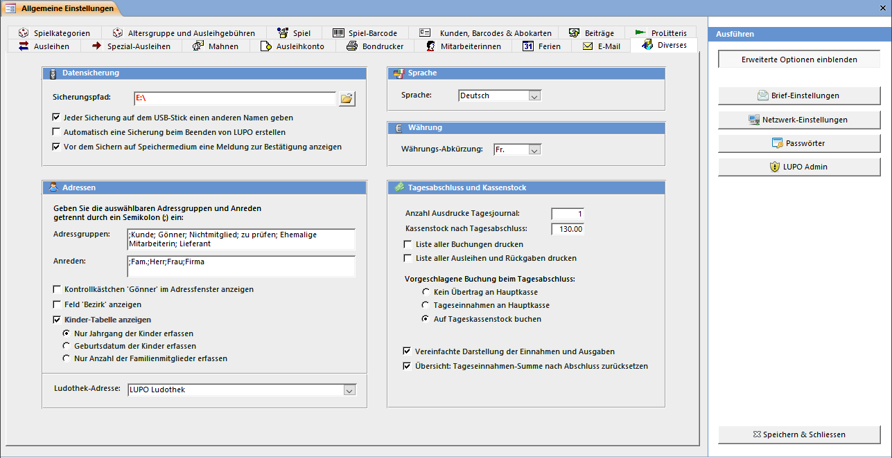

#### Datensicherung

Tragen Sie den kompletten Pfad mit Laufwerk ein. Beim Erstellen einer Datensicherung wird die USB-/ Disketten-Sicherungsdatei (rar-Archiv) an diesem Ort gespeichert. Ohne Häkchen bei Vor dem Sichern auf Speichermedium eine Meldung zur Bestätigung anzeigen wird beim Sichern via Beenden-Assistent keine Meldung mit der Info „USB-Stick an Laufwerk E: anschliessen" angezeigt. Diese Meldung kann deaktiviert werden wenn das Speichermedium immer verfügbar ist, z.B. bei einer Sicherung auf eine stets angeschlossene externe Harddisk.

#### Adressengruppe / Anreden

Im Adressfenster stehen Ihnen die durch eine Semikolon getrennten Einträge zur Auswahl. Im Adressgruppe sowie Anrede-Feld (im Adressfenster) kann anstelle einer Vorgabe auch ein freier Text erfasst werden.

#### Kinder-Tabelle anzeigen

Hier definieren Sie ob und wenn Ja, welche Informationen Sie beim Kunden erfassen möchten.

#### Ludothek-Adresse

Hier muss die Adresse der Ludothek ausgewählt sein. Alle System-Buchungen (z.B. Tagesabschluss) werden diesem Datensatz zugeordnet.

#### Sprache

Wählen Sie, ob die Texte in LUPO auf Deutsch, Französisch oder Italienisch angezeigt werden. Um die Sprache komplett zu wechseln, ist die Installation der entsprechenden Version der Access-Runtime notwendig.

#### Währung

Die Währung kann auch auf Euro gesetzt werden.

#### Tagesabschluss und Kassenstock

Beim Drucken des Tagesjournals nach der Tagesabschlussbuchung werden so viele Exemplare ausgedruckt, wie hier eingestellt. Zusätzlich zum Tagesjournal kann automatisch eine Liste mit allen Buchungen und / oder Ausleihen und Rücknahmen gedruckt werden.

Definieren Sie, was standardmässig mit den Tageseinnahmen beim Tagesabschluss geschehen soll. Der Betrag, welcher an die Hauptkasse gebucht wird, kann bei jedem Tagesabschluss beliebig angepasst werden.

Bei der vereinfachten Darstellung der Einnahmen und Ausgaben wird im Tagesjournal nur der Saldo der einzelnen Konten angezeigt, sonst werden auch das Soll und Haben ausgegeben.
