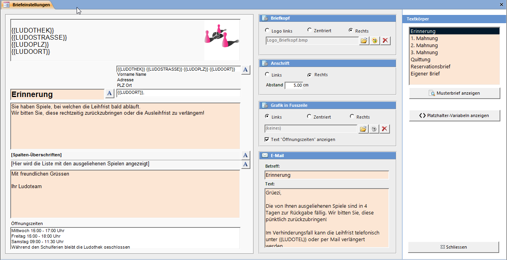

Das Aussehen der Briefe Mahnbrief, Reservationsbrief und Infobrief kann (mit beschränkten Möglichkeiten) Ihren Bedürfnissen entsprechend angepasst werden.

#### Schriftart und -grösse

Die Schriftart und Grösse der Textfelder kann durch Klicken auf A angepasst werden. Bei Textfeldern ohne diesen Knopf kann die Schrift mit der Formatierungs-Symbolleiste angepasst werden.

#### Logo im Briefkopf / Fuss auswählen

Die Einstellung der Position (Links / Mitte / Rechts) der Logo-Dateien hat nur einen Einfluss auf die Darstellung, wenn das Logo nach dem automatischen Einpassen in die verfügbare Fläche nicht bereits die volle Breite einnimmt.

#### Logo Grösse ändern

Falls Ihr Ludothek-Logo kleiner als die mögliche volle Grösse sein soll, müssen Sie das Logo in einem Bildbearbeitungsprogramm öffnen und ihm einen weissen Rand hinzufügen.

#### Absender oberhalb Anschrift

Im Textfeld oberhalb der Anschrift kann die Ludothek-Adresse eingetragen werden. Der Text ist durch das Fenster im Couvert sichtbar und wird von der Post als Absender akzeptiert.

#### Anschrift

Die Anschrift (Adresse des Kunden) kann links oder rechts ausgerichtet werden und mit dem Textfeld Abstand in ihrer vertikalen Position verschoben werden.

#### Textkörper

Die zwei grossen Textfelder und die Emailfelder können bei jedem Brief einen anderen Inhalt haben. Alle anderen Einstellungen gelten für jeden Brief.

>>>>>
Weitere Informationen zur Gestaltung der Briefe erhalten Sie, wenn Sie den Musterbrief anzeigen.