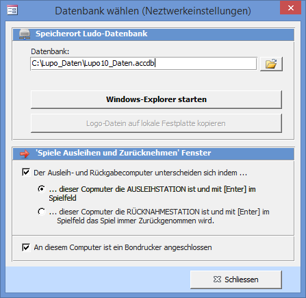
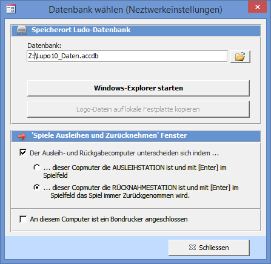
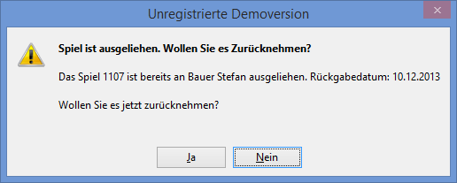

In die Netzwerkeinstellungen gelangen Sie durch die Übersicht mit **Einstellungen → Netzwerkeinstellungen**. Falls Sie mit zwei Computern arbeiten (Mehrplatz / Multiuser), muss der eine PC über das Netzwerk auf die Daten des anderen Computers zugreifen. Vorzugsweise sollten die Daten auf dem Ausleih-Computer gespeichert sein.

#### Einstellung auf dem Ausleih-PC (Server)

#### Einstellung auf dem Rücknahme-PC (Client)

!!! Der Computer, welcher die Daten über das Netzwerk liest (der Rücknahme-PC), kann nur verwendet werden, wenn der „Server" (Ausleih-PC) hochgefahren und angemeldet ist.

#### Datenbank

Wählen Sie die LUPO Datenbank **Lupo13_Daten.accdb** über den Dateiwahl-Dialog aus oder schreiben Sie den korrekten Pfad inkl. Datei in das Textfeld. Auch Netzwerkpfade wie **\\\PC-Ausleihe\Lupo_Daten** sind erlaubt.

#### Spiele ausleihen und zurücknehmen Fenster

Wenn Sie das Kontrollkästchen Der Ausleih- und Rücknahme Computer unterscheiden sich indem... aktivieren muss der eine Computer als Rücknahme- der andere als Ausleihstation definiert sein.

Auf der Ausleihstation werden Spiele mit <kbd>Enter</kbd> im Spielnummerfeld immer ausgeliehen (gilt auch beim Einlesen von Barcodes), bei der Rückgabestation immer zurückgenommen.

Ist ein Spiel bereits ausgeliehen (und Sie weisen LUPO trotzdem an das Spiel auszuleihen) so erscheint folgende Meldung:

Die Knöpfe Ausleihen und Rücknahme funktionieren auf beiden Arbeitsplätzen gleich. Sie können problemlos auf der Ausleihstation Spiele zurücknehmen oder mit dem Rückgabecomputer Spiele ausleihen.

#### Bondrucker

Setzen Sie das Häkchen wenn auf dem entsprechenden PC ein Bondrucker angeschlossen ist.

