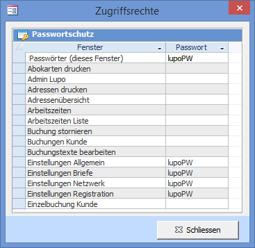
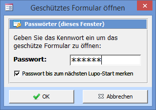

Jedes Fenster kann mit einem Passwort geschützt werden.

Fenster, bei welchen im Feld Passwort eine Zeichenfolge eingetragen ist, können nur durch Eingabe des korrekten Passwortes geöffnet werden.

