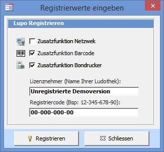

Die Registrierungsinformationen können Sie mit dem Übersichtsbefehl **Einstellungen => Registrierung** anzeigen.

Aktivieren Sie die von Ihnen bestellten Programmoptionen (Netzwerk, Barcode, Bondrucker) und tragen Sie den Namen Ihrer Ludothek sowie den Registriercode in die vorgesehenen Textfelder ein. Achten Sie auf die genaue Schreibweise. Drücken Sie auf Registrieren um die Demoversion-Einschränkungen aufzuheben.
