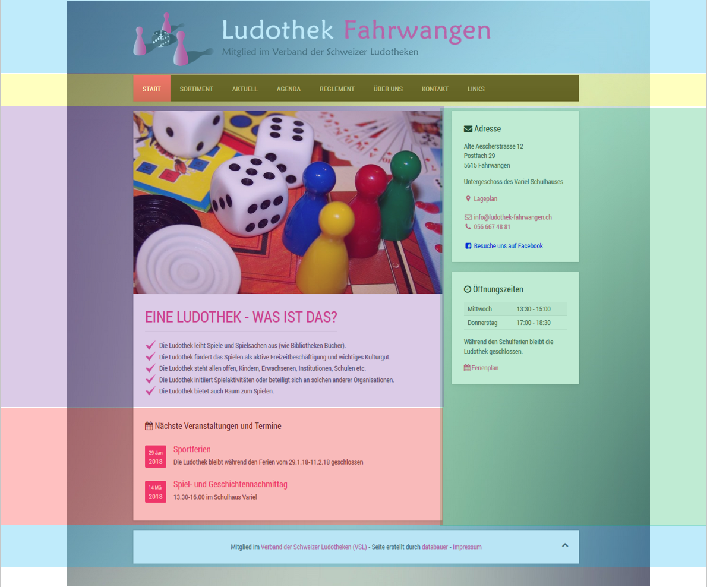
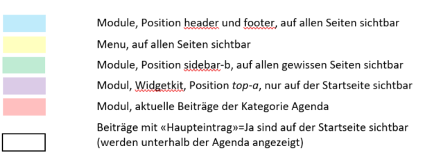

Der Inhalt der Website ist in verschiedene Bereiche unterteilt. Beiträge können direkt im Frontend bearbeitet werden, der andere Inhalt (Module) wird im Administrator verwaltet.

##Inhalte

Der Inhalt der Website ist in verschiedene Bereiche unterteilt. Beiträge können direkt im Frontend bearbeitet werden, der andere Inhalt (Module) wird im Administrator verwaltet.

| Menu | Objekt-Typ | Bearbeiten | 
| --- |--- |--- |
| Start |  Modul Home Slideshow (Widgetkit) / Modul Home Willkommen |  Administrator| 
| Sortiment |  Spiele aus LUPO |  Administrator | 
| Aktuell |  Alle Beiträge der Kategorie Aktuell |  Frontend oder Administrator |  
| Agenda |  Alle Beiträge der Kategorie Agenda |  Frontend oder Administrator |  
| Reglement |  Beitrag |  Frontend oder Administrator |  
| Über uns |  Beitrag |  Frontend oder Administrator |  
| Kontakt |  Erweiterung «Kontakt» |  Administrator | 
