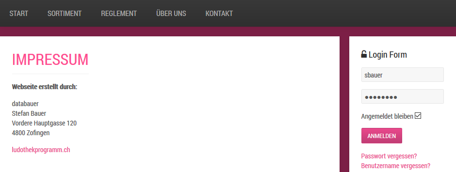

Die Inhalte und der Aufbau der Webseite können mit einem Benutzer-Login komplette kontrolliert werden. Mit dem CMS Joomla können kleinere Anpassungen an Beiträgen oder Modulen im Frontend ausgeführt werden. Für Änderungen an der Struktur (z.B. Menü) muss das Administrator-Fenster geöffnet werden.

#### Artikel im Frontend bearbeiten

Änderungen an bestehenden Beiträgen können direkt im Frontend vorgenommen werden. Dazu müssen Sie sich auf der Seite Impressum im Login-Bereich oben rechts anmelden:

Um einen Betrag im frontend zu bearbeiten müssen Sie sich anmelden und dann den Knopf  klicken.

#### Modul bearbeiten

Um den Inhalt eines Moduls zu bearbeiten kann im Frontend auf das Icon oben links geklickt werden:

## Administrator-Login

Sämtliche Inhalte der Website können über den Administrator kontrolliert werden. Melden Sie sich mit Ihrem Webseiten-Login unter **http://www.[ihre-ludothek-domain]/administrator/** an.

Nach erfolgter Anmeldung im Administrator wird das Kontrollzentrum angezeigt:

