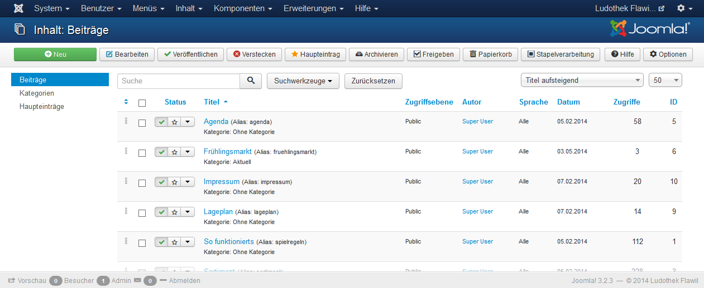

Ein Klick auf den Menüpunkt Inhalt => Beiträge öffnet die Seite zum Bearbeiten oder Erstellen von Beiträgen:

Es existieren drei Beitrags-Kategorien: Ohne Kategorie, Über uns und Aktuell. Beiträge der Kategorie Aktuell werden in der Webseite beim Menüpunkt Aktuell aufgeführt die mit Über uns unter dem entsprechenden Menülink.

#### Hauptbeiträge

Hauptbeiträge werden auf der **Startseite** angezeigt. Um einen Beitrag als Hauptbeitrag zu definieren muss unter Status der Stern gesetzt werden.

#### Beitrag bearbeiten

Ein Klick auf den Beitrag-Link öffnet die Seite zur Bearbeitung:

Soll der Beitrag unter Aktuell aufgeführt werden, muss die Kategorie entsprechend gesetzt werden.

Ein Beitrag kann geteilt werden, so dass nur der Anriss angezeigt wird und der volle Text erst durch mit einem Klick auf Weiterlesen angezeigt wird. Dies wird erreicht, indem im Editor an entsprechender Stelle mit dem Knopf Weiterlesen ein Trennbalken eingefügt wird.

Wenn formatierter Text, z.B. aus einem Word-Dokument, kopiert wurde sollte der Text ohne Formatierung eingefügt werden. Dies kann mit folgendem Editor-Symbol erreicht werden:

#### Beiträge unter "Aktuell"

Bei Beiträgen in der Kategorie Aktuell wird das Datum angezeigt, welches unter Erstellungsdatum gespeichert ist. Der Zeitraum, in welchem der Artikel auf der Website angezeigt wird, kann mit den beiden Daten Veröffentlichung starten und Veröffentlichung beenden definiert werden.

#### Beiträge unter "Agenda"

Agenda-Einträge werden sortiert nach dem Veranstaltungsdatum (=Erstellungsdatum) angezeigt. Im Menüpunkt „Agenda" werden alle Beträge der Kategorie aufgelistet und zusätzlich können auf der Startseite die aktuellsten Anlässe durch ein Modul angezeigt werden. In den Modul-Einstellungen kann die Anzahl der Veranstaltungen definiert werden.

Die Daten **Veröffentlichung starten** und **Veröffentlichung beenden** steuern die Sichtbarkeit der Veranstaltung.

Das **Erstellungsdatum** muss auf das Veranstaltungsdatum gesetzt werden und wird auf der Webseite angezeigt:

Unter **Bilder und Links** kann ein Einleitungsbild und eine Beitragsbild definiert werden:

Für eine optisch anspruchsvolle Liste sollten alle Einleitungsbilder ein etwa gleiches Seitenverhältnis haben. Weiter ist zu empfehlen die Einleitungsbilder vor dem Hochladen in einem Grafikprogramm zu verkleinern. Empfehlenswert ist eine Grösse von maximal 800 x 600 Pixel und unter 100 KB.

#### Bilder und Dateien hochladen und in Beitrag einfügen

Bilder und Dateien können auch direkt im Artikel-Text eingefügt werden. Mit folgendem Icon öffnet sich der Bilder-Manager:

Klicken Sie auf das Icon  um ein neues Bild hochzuladen. Folgendes Fenster öffnet sich:

Bitte beachten Sie, dass Fotos nicht in voller Auflösung (der Digi-Cam) hochgeladen werden sollten. Es besteht zwar die Möglichkeit durch Aktivierung des Häkchens „Grösse ändern" die Bilder nach dem Hochladen klein zu rechnen, allerdings empfiehlt es sich, dies bereits vorher in einem Grafikprogramm zu erledigen.
