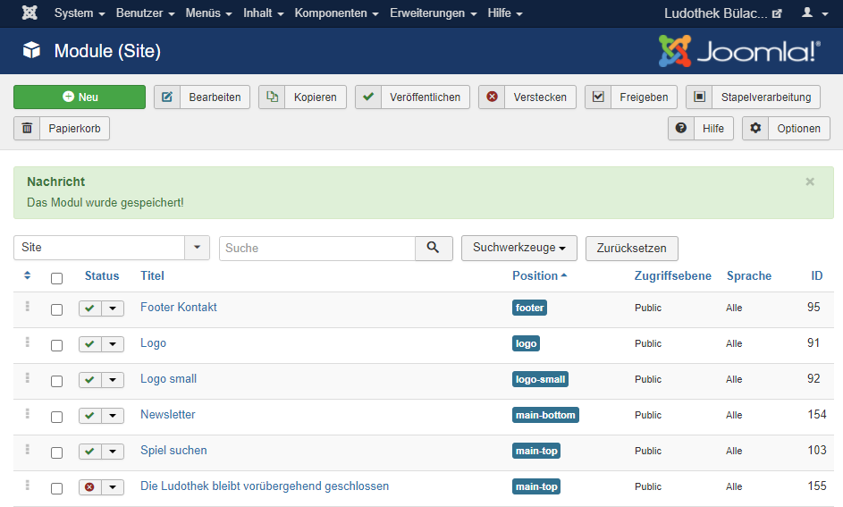
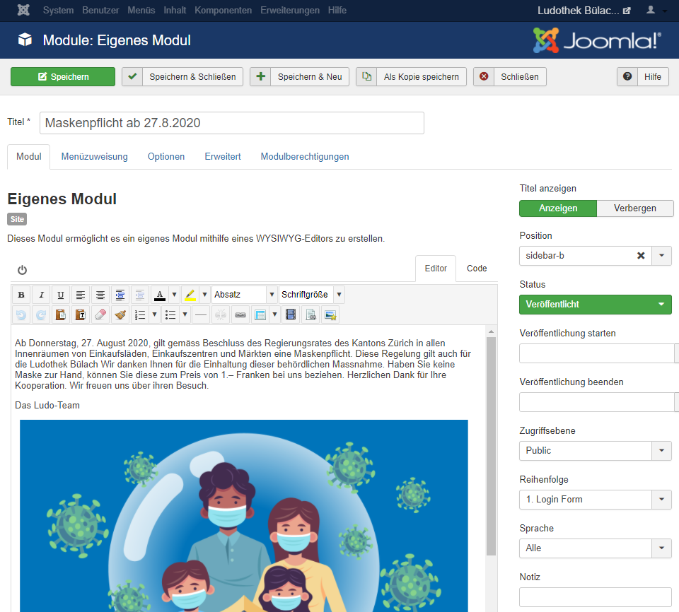
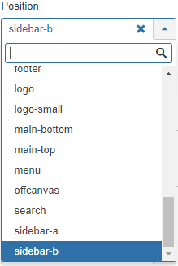
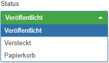
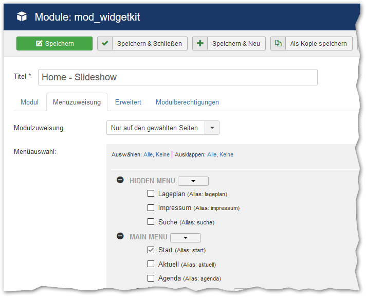
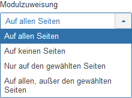

Ein Klick auf den Menüpunkt Module (im Kontrollzentrum links unter Struktur oder mit dem Menübefehl Erweiterungen → Module) zeigt alle vorhandenen Module an:

Es gibt verschiedene Modultypen, benutzerdefinierte Inhalte werden mit dem Typ **Eigenes Modul** erstellt. In dieser Anleitung wird auf diesen eingegangen. Um ein Modul zu bearbeiten kann auf den Titel des Modules geklickt werden. Die Seite zum Bearbeiten wird angezeigt, hier des Modultyps **Eigenes Modul**:

Titel, Inhalt und weitere Optionen, welche die Anzeige des Moduls steuern, werden hier definiert.  

### Position

Mit **Position** wird bestimmt wo das Modul angezeigt wird. 

Die wichtigsten Positionen sind:

| Position | Anzeige auf Webseite | 
| --- |--- |
| Top A | Unterhalb Menu, oberhalb Sidebar |
| Top B | Unterhalb Top A, oberhalb Sidebar |
| Top C | Unterhalb Top B, oberhalb Sidebar |
| Sidebar A | Sidebar links |
| Sidebar B | Sidebar rechts |
| Main Top | Oberhalb Beitrag, neben Sidebar |
| Main Bottom | Unterhalb Beitrag, neben Sidebar |
| Bottom A | Oberhalb Bottom B, unterhalb Sidebar |
| Bottom B | Oberhalb Bottom C, unterhalb Sidebar |
| Bottom C | Oberhalb Footer, unterhalb Sidebar |

### Sichtbarkeit steuern

Mithilfe des Knopfes **Status** kann die Sichtbarkeit des Moduls gesteuert werden. Durch setzen eines Datums bei **Veröffentlichung starten/beenden** kann ebenfalls die Sichtbarkeit gesteuert werden. 

### Menüzuweisung

Mit der **Menüzuweisung** wird gesteuert, auf welchen Seiten das Modul sichtbar sein soll. 

Bei **Modulzuweisung** kann zwischen verschiedener Anzeigelogik gewählt werden:

Entsprechend der Anzeigelogik und den gesetzten Häkchen unter **Menüauswahl** wird das Modul auf den entsprechenden Seiten angezeigt.   
