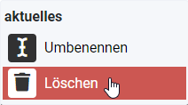

Mit dem Medien-Manager können Medien hochgeladen werden.

Um neue Medien hochzuladen oder bestehende zu löschen ist im Administrator unter **Inhalt → Medien** folgendes Fester zu öffnen:

Die Ordner sind benannt nach den Menüpunkten. Es ist ratsam, Medien in die jeweiligen Ordner hochzuladen, die dem zugehörigen Menüpunkt entsprechen.

##Verzeichnis erstellen

Ein neues Verzeichnis kann durch einen Klick auf Neues Verzeichnis anlegen erstellt werden.

Nach Eingabe eines passenden Verzeichnisnamens kann das Verzeichnis erstellt werden.

Mithilfe eines Doppelklicks auf das Verzeichnis gelangt man in das Verzeichnis.

##Verzeichnis umbenennen / löschen

Ein Verzeichnis kann durch einen Klick auf die 3 Punkte umbenennt oder gelöscht werden.

Verzeichnisnamens

###Verzeichnis umbenennen

Nach Eingabe eines passenden Namen kann das Verzeichnis umbenennt werden.

###Verzeichnis löschen
Um ein Verzeichnis zu löschen ist ein Klick auf **Löschen** und danach nochmal auf **Löschen** benötigt.

##Medien hochladen

Das Hochladen von Medien wird durch das Betätigen der Schaltfläche Hochladen ermöglicht.

Nachher kann ein Medium freier Wahl ausgewählt und hochgeladen werden.

##Medium umbenennen / löschen

Ein Medium kann durch einen Klick auf die 3 Punkte umbenennt oder gelöscht werden.

###Medium umbenennen
Nach Eingabe eines passenden Mediums kann das Verzeichnis umbenennt werden.

###Medium löschen
Um ein Medium zu löschen ist ein Klick auf **Löschen** und danach nochmal auf **Löschen** benötigt.

