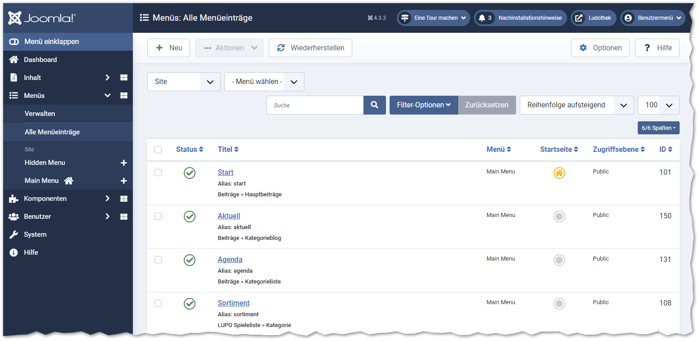
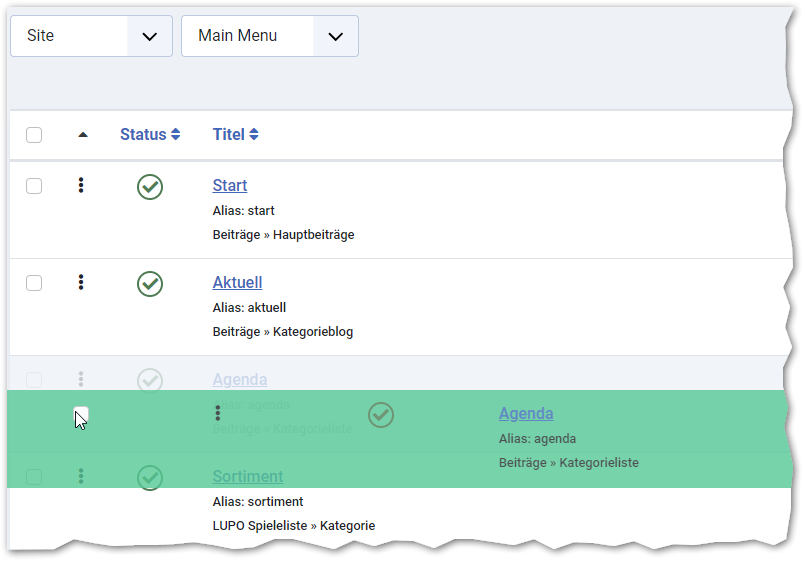
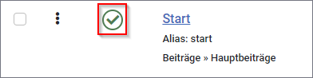
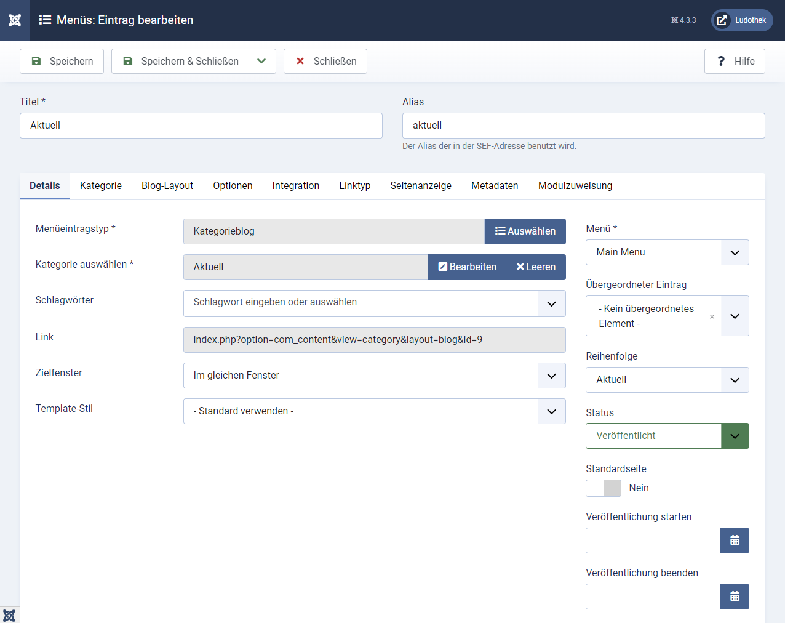
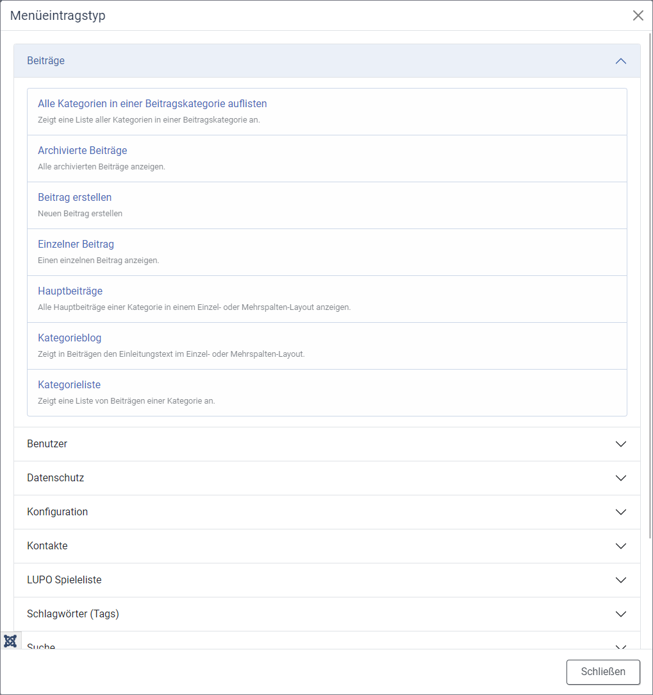

Im Menü können Inhalte, z.B. einzelne Seiten oder Seiten-Kategorien, verknüpft werden.

Das auf der Ludothek-Webseite angezeigte Menü ist als **Main Menu** gespeichert. Diese muss bearbeitet werden.

#### Reihenfolge Menüeintrag
Um die Position eines Menü-Eintrags zu ändern muss die Sortierung nach Sortierwert (1) aktiviert sein. Ist dies der Fall, so werden die drei Punkte (2) aktiv. Diese können nun mit der Maus geschnappt und an die gewünschte Position gezogen werden (drag & drop).

#### Menüpunkt aktivieren / deaktivieren
Die Häckchen unter Status zeigen an, ob der Menüpunkt sichtbar ist oder nicht. Ist im Kreis ein **grünes Häckchen**, so ist der Menü-Eintrag sichtbar. Ist im Kreis ein **graues Kreuz** heisst das, dass der Menü-Eintrag nicht sichtbar ist.

#### Menüpunkt hinzufügen oder bearbeiten
Ein neuer Menü-Eintrag kann durch einen Klick auf + Neu erstellt werden, bestehende öffnen Sie durch einen Klick auf den Menütitel.

Der **Menüeintragstyp** bestimmt die "Seiten-Art", so kann hier bestimmt werden, ob ein einzelner Beitrag, eine Beitragskategorie oder eine der vielen weiteren Inhaltstypen angezeigt wird:

