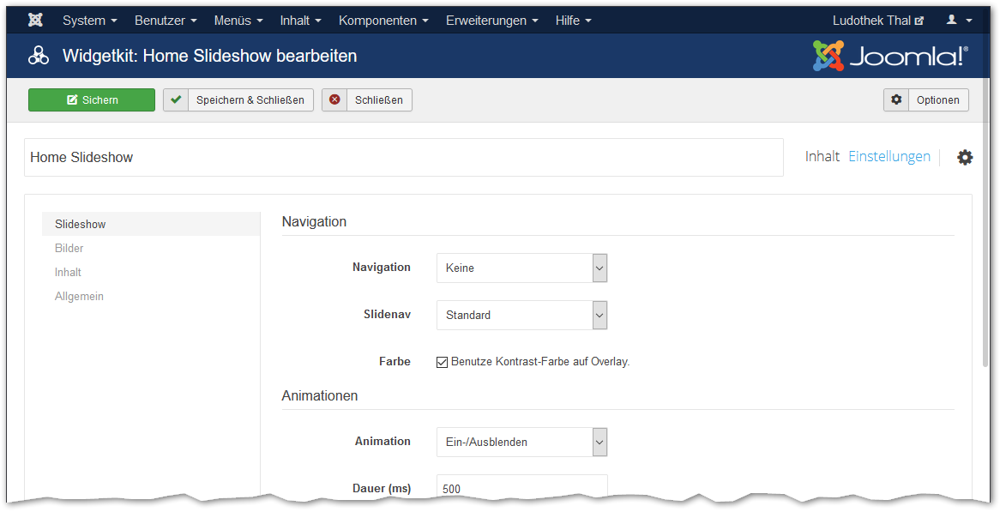

Mit der Erweiterung Widgetkit kann eine Slideshow wie auf der Frontseite erstellt werden. Ebenfalls der Lageplan mit der Google-Maps Karte ist mit Widgetkit erstellt.

Um neue Widgets zu erstellen oder bestehende zu bearbeiten ist im Administrator unter Komponenten => Widgetkit folgendes Fenster zu öffnen:

Auf das Element (z.B. «Lageplan») klicken um die Slideshow zu bearbeiten:

Im Editier-Fenster der Slideshow können Bilder hinzugefügt, verändert neu sortiert oder gelöscht werden.

Um die Anzeigeeinstellungen des Widgets zu verändern muss das Modul geöffnet werden. Die Module sind im Administrator unter **Erweiterungen => Module** zu finden:

Im geöffneten Modul kann auf den Knopf Widgetkit geklickt werden um die Anzeige-Einstellungen zu öffnen:

