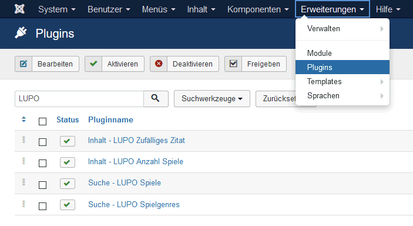
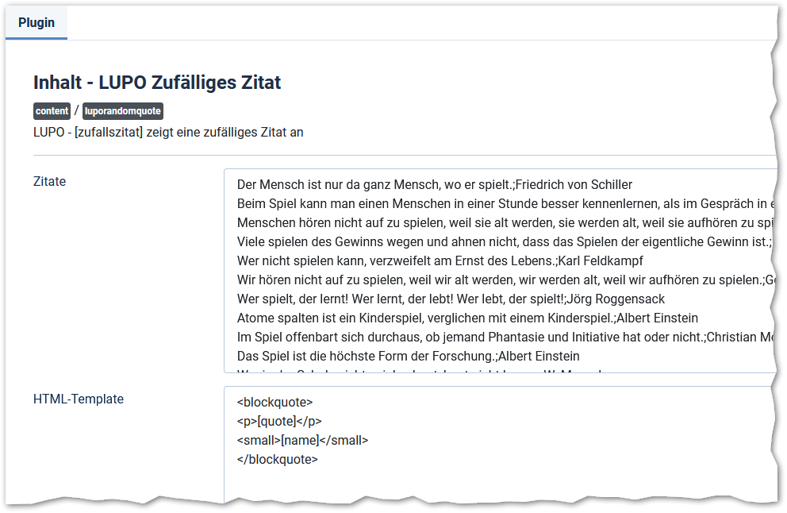
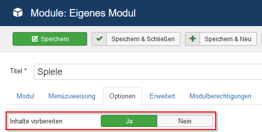

Mit einem Content-Plugins kann ein Platzhalter in einem Beitrag oder Modul automatisch mit berechnetem Inhalt ersetzt werden.

Es stehen zwei LUPO Inhalt-Plugins, **Anzahl Spiele** und **Zufälliges Zitat**, zur Verfügung:

##Inhalt - LUPO Anzahl Spiele

Damit kann die Anzahl der in der Spieldatenbank gespeicherten Spiele im Text eingefügt werden. 

Im Editor wird dazu der Platzhalter **[totalspiele]** gesetzt:

##Inhalt - LUPO Zufälliges Zitat

Mit diesem Plugin ist es möglich, ein zufälliges Zitat gemäss dem definiertem Anzeige-Template in der Webseite einzubetten:

Die zur Auswahl stehenden Zitate sind unter **Erweiterungen → Plugins** bei den Plugin-Optionen definiert:

Im Textefeld **Zitate** sind alle zur Auswahl stehenden Zitate definiert. Das Plugin wird mit einer Auswahl an vordefinierten Zitaten ausgeliefert. Sie können nicht erwünschte Zitate löschen oder weitere hinzufügen. Ein einzelnes Zitat muss aus einer Zeile stehen und der Urheber des Zitates mit einem Semikolon getrennt werden. 

In die bei der Option **HTML-Template** definierte Design-Vorlage wird das Zitat gerendert. Im Platzhalter **[quote]** wird das Zitat platziert, bei **[name]** der Urheber. 

Anstelle des vorgegebenen Templates könnte z.B. auch folgendes Layout verwendet werden:

`
[quote] <em>[name]</em>
`

!! **Platzhalter in eigenen Modulen**  
!! Beachten Sie, dass Platzhalter in einem eigenen Modul nur verarbeitet werden, wenn unter **Optionen** bei **Inhalte vorbereiten** der Wert **Ja** gespeichert ist.

