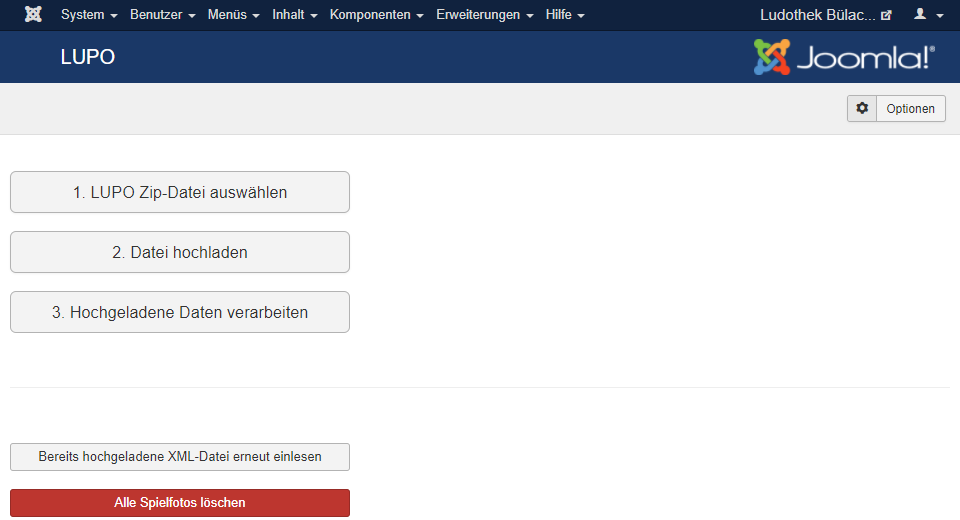

Das aus dem LUPO erstellte zip mit den Spielen kann im **Joomla-Administrator** hochgeladen werden. Dazu ist das Fenster unter **Komponenten  LUPO Spielliste** zu öffnen:

Um die aus dem LUPO exportierte Spieleliste ins Joomla zu importieren, die **zip-Datei Auswählen** und dann mit dem Knopf **Datei hochladen** auf dem Server speichern. Danach können mit der Funktion **Hochgeladene Daten verarbeiten ** die Spiele eingelesen werden
