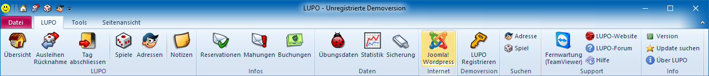
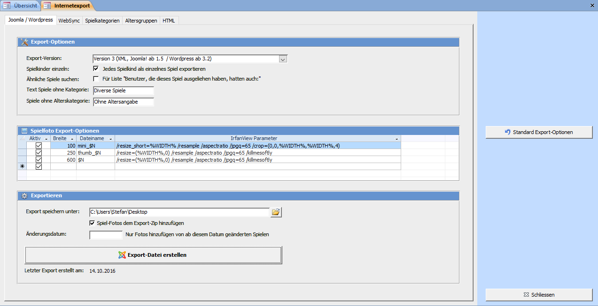
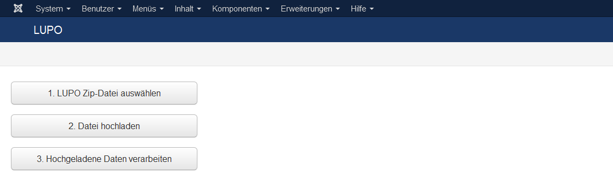

Wenn an den Spiele-Daten etwas geändert oder ein neues Spielfoto erfasst wird, muss der komplette Spiele-Katalog im LUPO exportiert und auf der Webseite im Joomla-Administrator importiert werden.

##1. Spielliste in LUPO exportieren

Das Exportfenster wird vom LUPO-Menüband mit dem Button **Joomla!** geöffnet.

Mit dem Knopf Export-Datei erstellen wird eine zip-Datei mit den gewählten Einstellungen und Inhalten erstellt.

##2. Spielliste in Joomla importieren

Das aus dem LUPO erstellte zip mit den Spielen kann im **Joomla-Administrator** hochgeladen werden. Das Fenster kann mit dem Menübefehl **Komponenten → LUPO Spielliste** oder mit dem Link **Spiele aktualisieren** im Dashboard. 

Um die zuvor exportierte Spieleliste ins Joomla zu importieren, die LUPO Zip-Datei auswählen und dann mit dem Knopf Datei hochladen auf dem Server speichern. Danach können mit der Funktion Hochgeladene Daten verarbeiten die Spiele eingelesen werden.

#####Alle Spielfotos löschen
Diese Funktion kann vor dem Upload der Spieledatei gedrückt werden um alle auf dem Server gespeicherten Spielefotos zu löschen.
Hintergrund: Beim Upload der Spieldaten werden neue Spielfotos hinzugefügt und existierende überschrieben, von im LUPO gelöschten Spielen bleiben dies Fotos aber auf dem Server erhalten.
