Unter **System** → **Konfiguration** → **LUPO Spielliste** befindet sich diese Kategorie. Mithilfe der Kategorie **LUPO Spielliste** kann die Seitenansicht bearbeitet werden.

Oder über den Optionen-Button in der LUPO-Komponente:
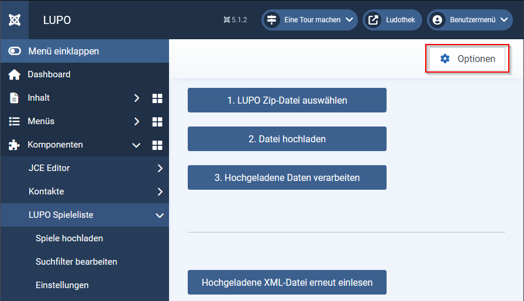

##Kategorien
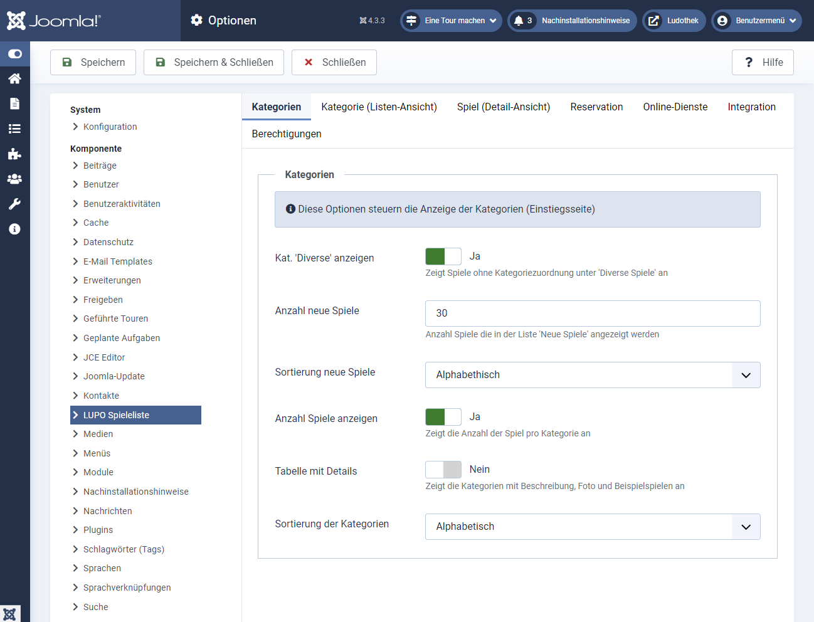

##Kategorie
Unter **Kategorie (Listen-Ansicht)** kann der Vorschau, der Spiele bearbeitet werden. **Anzahl-Tage** zeigt die Anzahl Tage zum Ausleihen an.

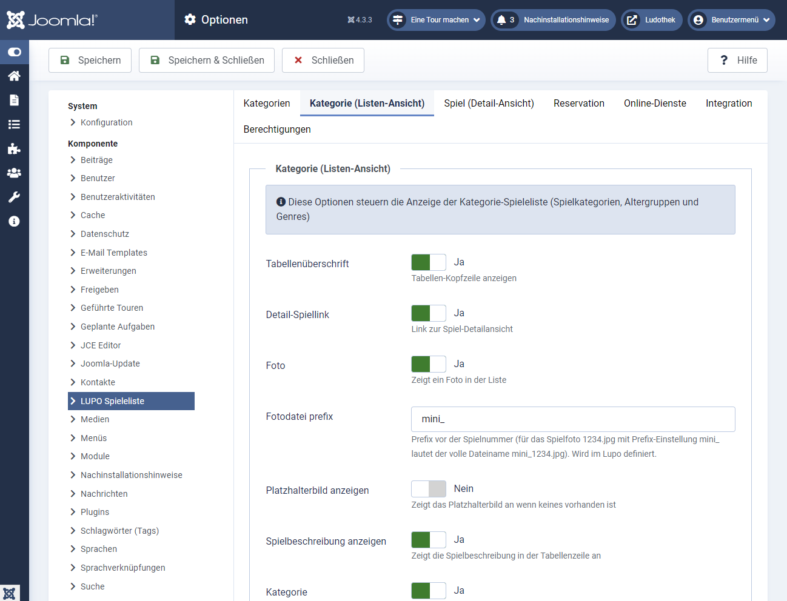

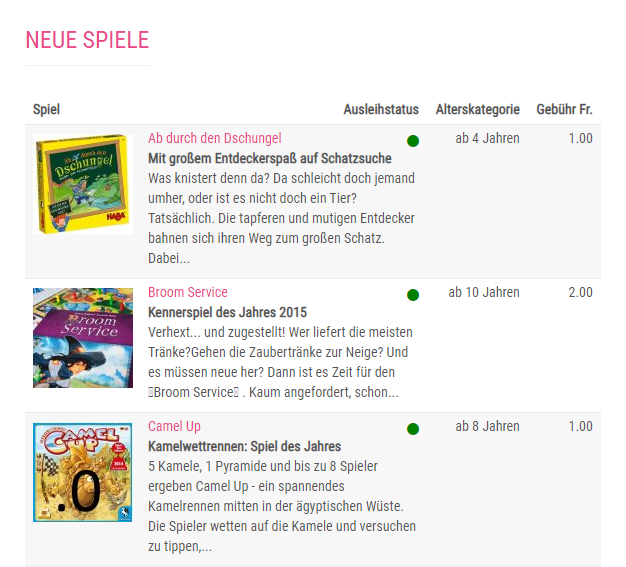

##Spiel (Detail-Ansicht)
Unter **Spiel (Detail-Asnicht)** kann man die Detailansicht des Spiels bearbeiten. 

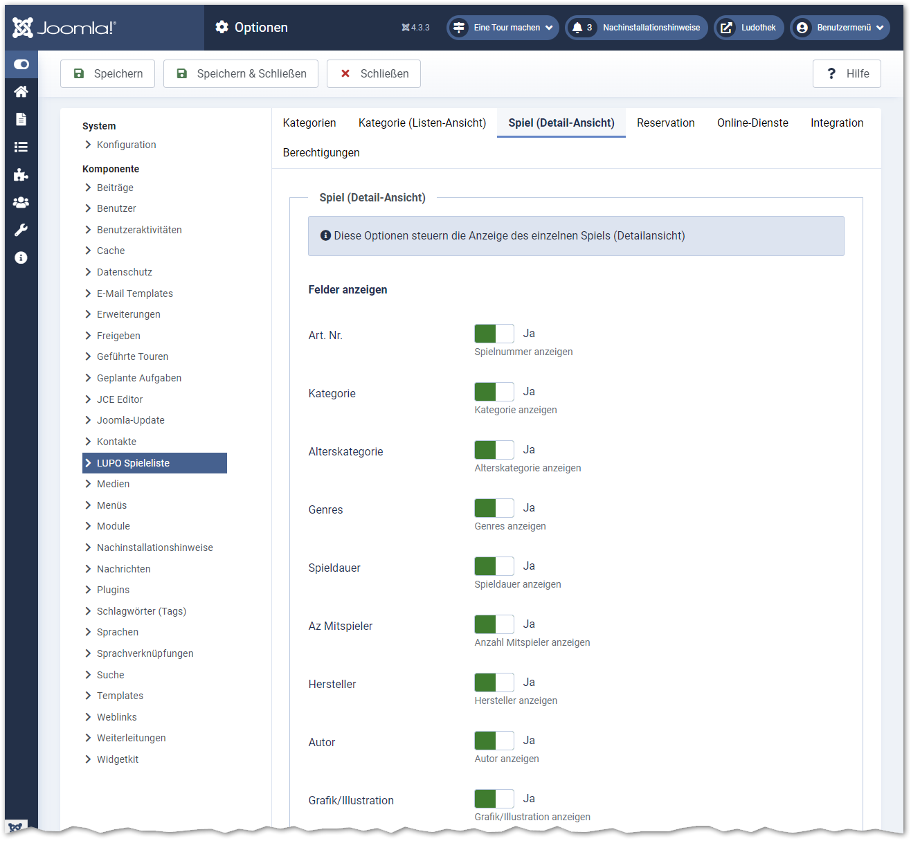

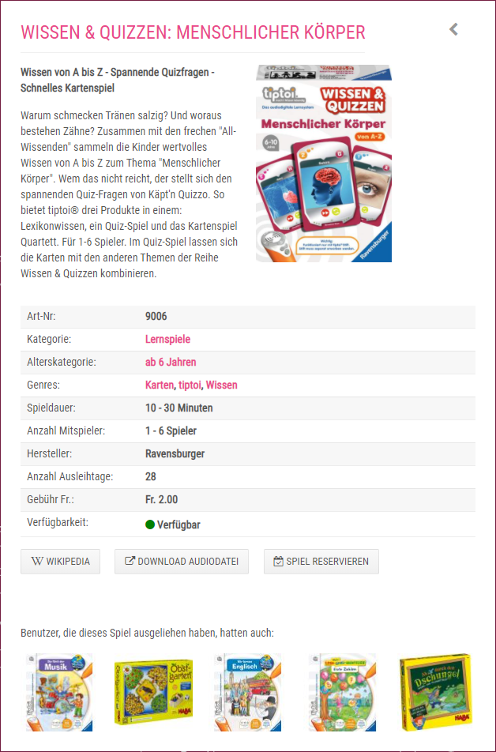

##Reservation
Unter **Reservation** können Sie das "Spiel Reservieren-Formular" bearbeiten. Um auf dieses Formular zu gelangen, muss man beim Kundenlogin-Fenster der Knopf Reservationen senden geklickt werden.

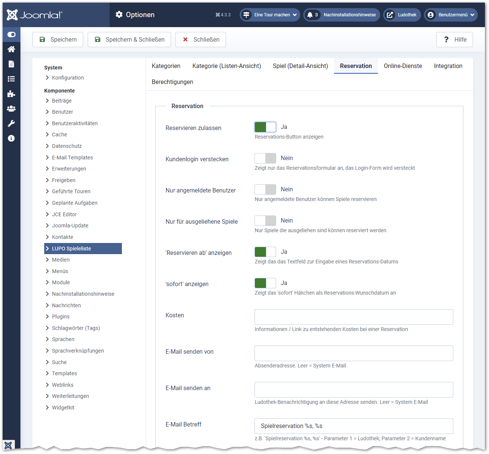

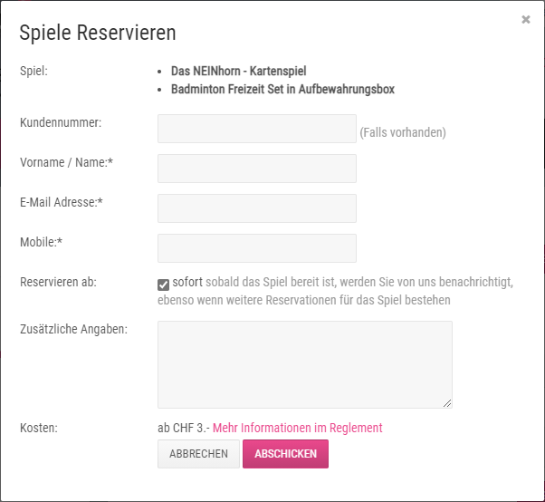

##Online-Dienste
Unter **Online-Dienste** können Optionen rund um den Ausleihstatus und WebSync-Verknüpfung konfiguriert werden.

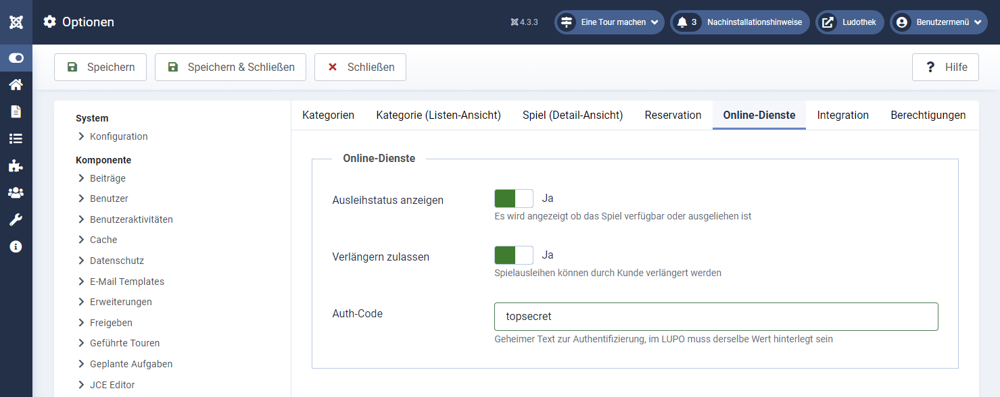

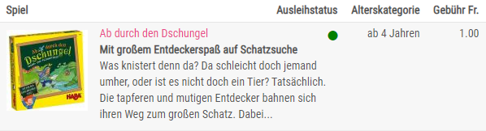

##Integration
Zu guter letzt kannim Tab **Integration** unter Menü-Kategorie-Link die Joomla ItemID bestimmt werden.

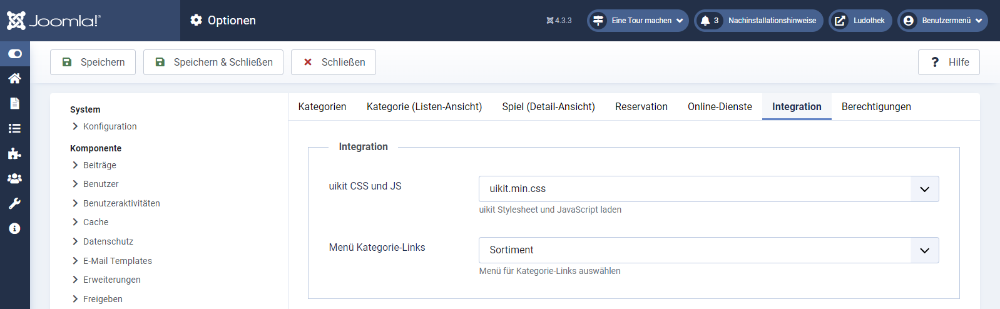

## Modul Spielangebot

Dieses Modul zeigt eine Navigation mit Spielkategorien und Genres an: 

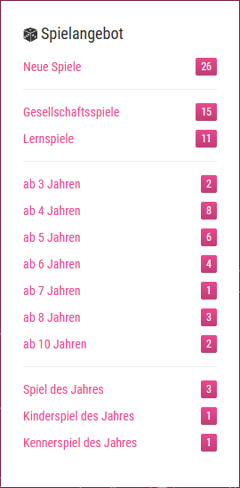

Im Joomla-Administrator kann unter **System → Site Module** das Modul geöffnet und konfiguriert werden:

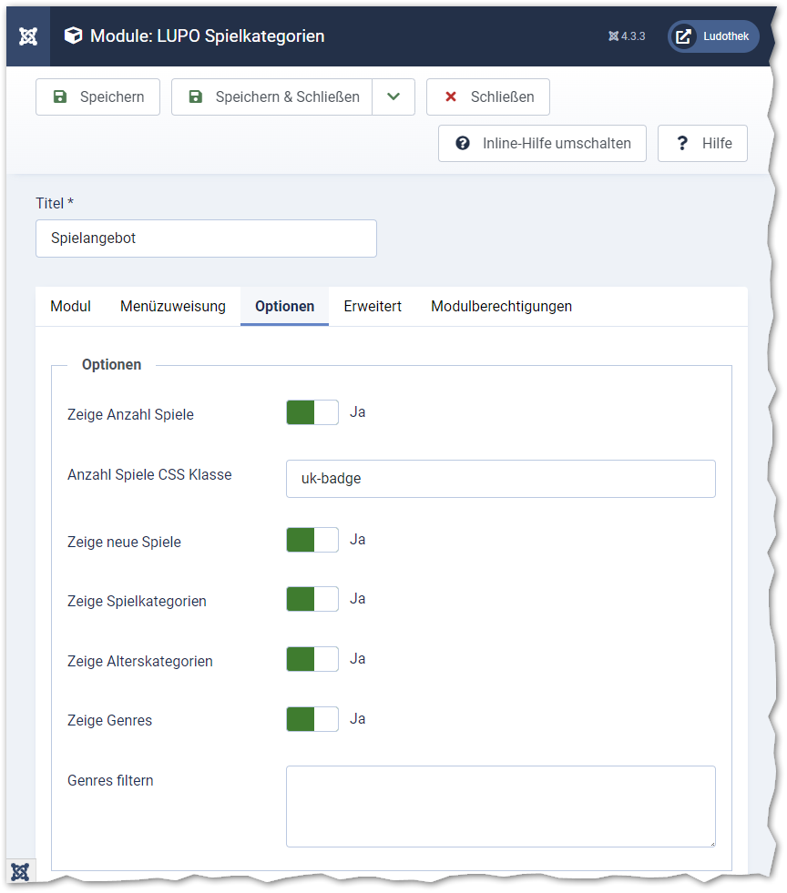

Mit aktivierter Option **Zeige Anzahl Spiele** wird neben dem Kategorie-Text ein Badge mit der Anzahl Spiele angezeigt.

Sollen nicht alle Genres angezeigt werden, so können im Feld **Genres filtern** die gewünschten eingetragen werden. Pro Zeile muss ein Genre geschreiben werden. Achten Sie auf die exakte Schreibweise! Die Anzeigereihenfolge entspricht der Eingabe. 

