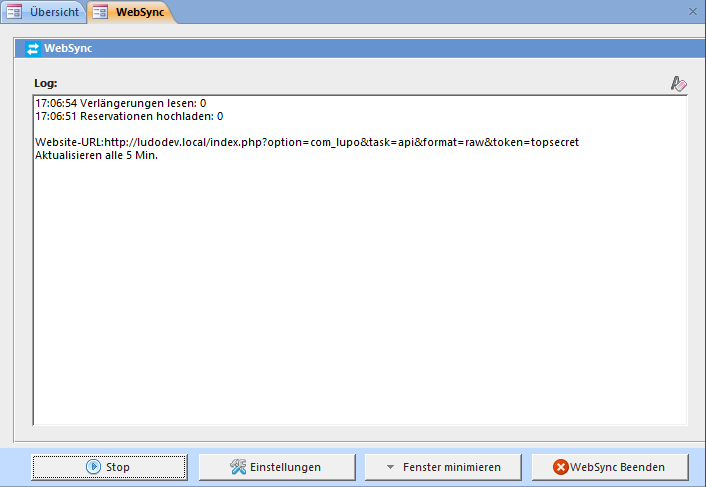

Auf der Webseite kann der Ausleihhstatus (ausgeliehen/verfügbar) des Spiels angezeigt werden:

Neben dem Ausleihstatus ist das WebSync Programm auch zuständig zur Übermittlung der vom Kunden ausgeliehenen Spiele (für Kundenlogin auf der Webseite) sowie zum Einlesen der durch den Kunden online getätigten Verlängerungen.

##Websync einrichten

Das WebSync-Programm kann vom LUPO her gestartet werden:

Bei gesetztem Häkchen öffnet sich das Programm automatisch und minimiert sich nach dem Start in die Taskleiste.

In den WebSync-Einstellungen können folgende Werte definiert werden:

**Webseite URL**  
Tragen Sie hier die Adresse Ihrer Webseite ein, z.B. https://ludothek-zofingen.ch/

**Authentifizierungs-Code**  
Dies ist das "Passwort" für den Dienst zum Schreiben und Lesen der Daten auf Ihrer Webseite. 
Derselbe Wert muss im Joomla-Administrator bei den LUPO-Optionen gespeichert werden:

Vergessen Sie nicht vor dem Herunterfahren des PCs auch das WebSynx-Programm zu schliessen.
