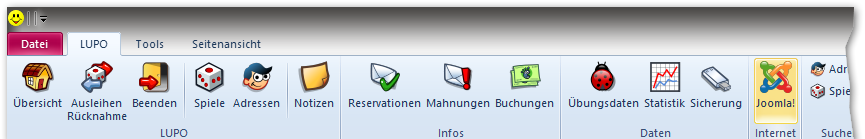

Auf der Webseite kann der Ausleihhstatus (verfügbar/reserviert/ausgeliehen) des Spiels angezeigt werden:

Neben dem Ausleihstatus ist das WebSync Programm auch zuständig zur Übermittlung der vom Kunden ausgeliehenen Spiele (für Kundenlogin auf der Webseite) sowie zum Einlesen der durch den Kunden online getätigten Verlängerungen.

##WebSync einrichten

Das WebSync-Programm kann im Fenster **Joomla / Internetexport** konfiguriert und gestartet werden.

Wenn WebSync genutzt wird, sollte es automatisch mit dem LUPO-Programm gestartet werden. Falls im Netzwerk gearbeitet wird, empfiehlt sich, dass das WebSync auf dem "Haupt"-PC ausgeführt wird.

!! Wird im Netzwerk gearbeitet, darf das WebSync-Programm nur einmal gestartet werden. Alle Änderungen vom anderen PC, z.B. Rücknahmen, werden auch vom Haupt-PC erkannt und an die Webseite geschickt.

### Loginlink in E-Mail  
Im einen Erinnerungs- oder Mahnungs-E-Mail kann der Platzhalter **{{LOGINLINK}}** eingefügt werden. Im E-Mail an den Kunden wird dann dort der Link eingefügt, über welchen der Kunde direkt und ohne Anmeldung auf seinem Kundenprofil landet.

Wird bei **Loginlink-Text** der Wert "Spiele online verlängern" eingefügt, so erscheint der Link als [Spiele online verlängern](https://example.com/sortiment/kundenlogin?ll=0-LULU), ansonsten wird nur die URL angezeigt: [https://example.com/sortiment/kundenlogin?ll=0-LULU](https://example.com/sortiment/kundenlogin?ll=0-LULU) 

#### WebSync Fenster beim automatischen Öffnen nicht anzeigen

Ist diese Option aktiviert erscheint, so erscheint das WebSync nicht als Reiter neben dem Übersicht-Reiter. Falls WebSync läuft, wird in der Übersicht links unten ein Icon angezeigt.

### WebSync Einstellungen

Der Button Einstellungen öffnet ein Fenster zur Konfiguration.
 

**Verlängerungen**  
Es kann definiert werden ob Online-Verlängerungen kostenlos sind. Ist die Verlängerung nicht kostenlos, zählt dieselbe Logik, wie wenn im Ausleihfenster das Spiel manuell für den Kunden verlängert wird. 

Die Anzahl Verlängerungs-Tage sind in den [Einstellungen](/einstellungen/allgemeine-einstellungen/ausleihen#spiele-verlängern) definiert. Es werden die Tage der untersten Option verwendet (altes Rückgabedatum + x Tage). Beim Einlesen und Verarbeiten der verlängerten Spiele in LUPO wird der Ferienplan berücksichtigt. 

**Aktualisierungsintervall in Minuten**  
In diesem Intervall werden die Daten auf den WebServer geladen bzw. von diesem abgerufen. Der Mindestwert beträgt 5 Minuten.

**Webseite URL**  
Tragen Sie hier die Adresse Ihrer Webseite ein, z.B. https://ludothek-zofingen.ch

**Authentifizierungs-Code**  
Dies ist das "Passwort" für den Dienst zum Schreiben und Lesen der Daten auf Ihrer Webseite. 
Derselbe Wert muss im Joomla-Administrator bei den LUPO-Optionen gespeichert werden:

**Quarantäne-Tage für Retouren**  
Falls bei Quarantäne-Tage eine Zahl eingetragen ist gelten zurückgebrachte Spiele für die Anzahl eingetragenen Tages über das Rückgabedatum hinaus als ausgeliehen.

##Einstellungen in Joomla  

Im Joomla-Administrator bei der LUPO-Komponente unter Optionen kann im Reiter **Online-Dienste** folgendes definiert werden:

Der Auth-Code muss mit dem im LUPO eingetragenen Wert korrespondieren. 

