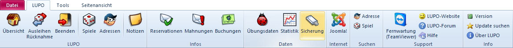
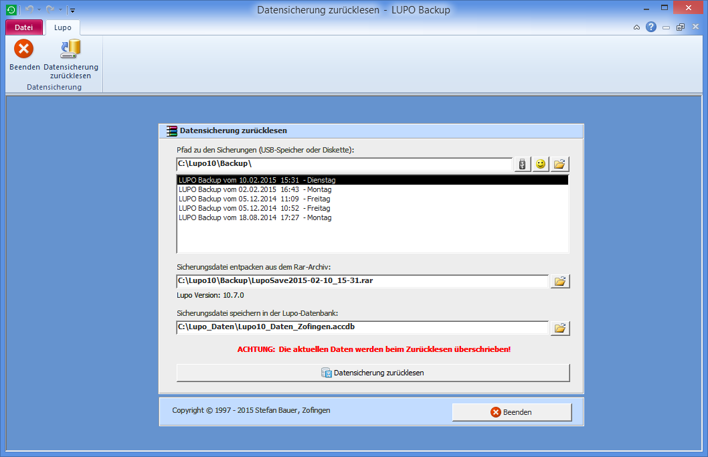

##Backup erstellen

Standardmässig speichert LUPO alle Benutzer-Daten im Ordner **C:\\Lupo_Daten**. In diesem Verzeichnis sind die Datenbank **Lupo13_Daten.accdb**, die Logo-Dateien, Spiel-Fotos und Spielanleitungen abgelegt. Die Datensicherung, welche beim entsprechenden Punkt im Beenden-Assistent durchgeführt wird, enthält aber nur die Daten-Datei. Eine Sicherung mit allen Benutzer-Daten kann manuell erstellt werden. Klicken Sie dazu im Menüband auf den Knopf Datensicherung:

Die ausgewählten Dateien werden komprimiert in einem RAR-Archiv gespeichert. Um den Inhalt von RAR-Dateien zu extrahieren kann die kostenlose Software [WinRAR](https://www.rarlab.com/) (Shareware) verwendet werden.

#### Komplettes Backup

Sichert alle Dateien im Ordner **[Lupo_Daten]** sowie alle Unterverzeichnisse und deren Dateien (rekursive Sicherung).

!!! Um die Backup-Dateigrösse möglichst klein zuhalten, sollten nicht mehr benötigte Dateien, z.B. alte Lupo_Daten accdb-Dateien aus dem Lupo_Daten Ordner gelöscht werden. 

##Backup zurücklesen 

Die Datensicherung kann nicht direkt aus LUPO zurück gelesen werden. Auf diese Funktion wurde bewusst verzichtet, da die aktuellen Daten dabei überschrieben werden. Sie müssen die Sicherung mit dem Programm **LUPO Datensicherung** zurück lesen.

Öffnen Sie dieses durch Drücken der Windows-Taste und anschliessendem Suchen nach **LUPO Datensicherung**:

Falls die LUPO-Einstellung Jeder Sicherung einen anderen Namen geben aktiviert ist, wird die Sicherungsdatei mit dem Datum und der Uhrzeit im Dateinamen abgespeichert. Solche Dateien haben auf der Festplatte oder dem USB-Stick Dateinamen wie **LupoSave2020-02-10_15-31.rar**

Der erste Button (USB-Stick) öffnet den im LUPO als externes Speichermedium definierter Pfad.

Der zweite Knopf (Smiley) öffnet das lokale Standard-Backupverzeichnis **C:\\Lupo13\Backup**.

Mit dem dritten Knopf (Ordner) wird das Fenster zur Auswahl eines Ordners angezeigt. Wählen Sie z.B. unter „Arbeitsplatz" den USB-Speicherstick mit Ihren Sicherungen.

Wenn im angegebenen Ordner LUPO-Sicherungen vorhanden sind, so werden dies aufgelistet. Wählen Sie eine Datei aus der Liste aus oder klicken Sie auf den Durchsuchen-Knopf um eine Sicherungsdatei auszuwählen.

Mit Datensicherung zurücklesen wird die aktuelle LUPO Datendatei mit den Daten aus dem Rar-Archiv der Sicherungsdatei überschrieben.

!!! Beim Zurücklesen der Datensicherung wird ein Backup der vorhandenen Datei erstellt, bevor diese überschrieben wird.

!! Es können nur Sicherungen der aktuellen LUPO Version eingelesen werden. Sicherungen einer früheren LUPO-Version müssen nach dem zurücklesen mit dem LUPO-Update Programm ins aktuelle Format konvertiert werden.
