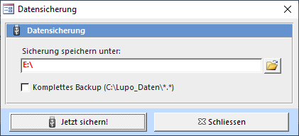

Standardmässig speichert LUPO alle Benutzer-Daten im Ordner **C:Lupo_Daten**. In diesem Verzeichnis sind die Datenbank **Lupo10_Daten.accdb**, die Logo-Dateien und die Spiel-Fotos abgelegt. Die Datensicherung, welche beim entsprechenden Punkt im Beenden-Assistent durchgeführt wird, enthält aber nur die Daten-Datei. Eine Sicherung mit allen Benutzer-Daten kann manuell erstellt werden. Klicken Sie dazu im Menü auf den Knopf Datensicherung:

Die ausgewählten Dateien werden komprimiert in einem RAR-Archiv gespeichert. Um den Inhalt von RAR-Dateien zu extrahieren kann die kostenlose Software WinRAR (Shareware-Version) verwendet werden.

#### Logo-Dateien sichern

Sicherung folgender Dateien im Ordner Lupo_Daten: *.bmp / *.jpg / *.png / *.gif

#### Spiel-Fotos sichern

Sichert die Dateien **[Lupo_Daten]Spiele-Fotos*.***
