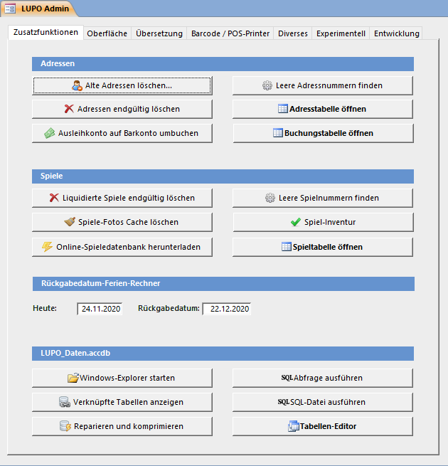

Das LUPO Admin Fenster enthält erweiterte Funktionen und ist für fortgeschrittene Benutzer und Administratoren gedacht. Das Fenster kann durch einen Button in den Allgemeinen Programmeinstellungen oder durch Drücken der Tastenkombination <kbd>Ctrl</kbd> + <kbd>F12</kbd> geöffnet werden.

Diese Funktionen sollten nur von erfahrenen LUPO- und Computerbenutzern verwendet werden! Wenn Sie Daten in der Tabellenansicht verändern, sollten Sie sich bewusst sein, was Sie tun. Es sind fast keine Kontrollmechanismen aktiv; Sie können die Daten so verändern, dass das LUPO-Programm danach nicht mehr korrekt funktioniert!

## Zusatzfunktionen

### Adressen

#### Alte Adressen löschen
Mit dieser Funktion werden alle Adressen deren Abo-Enddatum kleiner als Ihre Eingabe ist auf den Status gelöscht gesetzt. Gelöschte Adressen können im Kunden-Fenster mit Nur Gelöschte Adressen anzeigen angezeigt und wieder aktiviert (wiederhergestellt) werden.

#### Adressen endgültig löschen
Adressen, welche den Status gelöscht haben werden **ENDGÜLTIG** gelöscht werden. Dieser Befehl kann ausgeführt werden nachdem die alten Adressen mit der oberhalb beschriebenen Funktion gelöscht wurden.

#### Leere Adressnummern finden
Findet alle unbenutzten Nummern zwischen 1 und der grössten, bereits vergebenen. Die gefundenen freien Nummern werden der **manuellen Barcode-Druckliste** hinzugefügt.

#### Adresstabelle öffnen
Zeigt alle Adressdaten in einer Tabelle an. Sie können die Daten **sortieren** und mit dem Menübefehl **Suchen und Ersetzen** mehrere Zeilen auf einmal verändern.

### Spiele

#### Liquidierte Spiele endgültig löschen
Diese löscht die liquidierten Spiele inkl. aller Ausleihen und statistischen Daten deren. **Dies ist nicht zu empfehlen. Verwenden Sie stattdessen die Funktion Nummern liquidierter Spiele freigeben im Spiele-Fenster**.

#### Spiele-Fotos Cache löschen
Zu jedem Spielfoto wird automatisch ein kleines Bild in C:\\Lupo_Daten\\Spiele-Fotos\\thumbs gespeichert. Diese Funktion leert den Ordner damit alle Bilder neu generiert werden. 

#### Leere Spielnummern finden
Findet alle unbenutzten Nummern zwischen 1 und der grössten, bereits vergebenen. Die gefundenen freien Nummern werden der **manuellen Barcode-Druckliste** hinzugefügt.

#### Spiel-Inventur
Öffnet ein Fenster zum Inventarisieren der Spiele, idealerweise durch Einscannen. Je nach Spielstatus (gefunden, fehlt, liquidiert, lange nicht ausgeliehen) wird ein anderer Sound abgespielt.

### Rückgabedatum-Ferien-Rechner
Mit dieser Funktion kann das Berechnen des Rückgabedatums simuliert werden. Im Feld **Heute** kann ein beliebiges Datum ausgewählt werden. Das **Rückgabedatum** wird dann dem eingegebenen Datum unter Berücksichtigung des Ferienplans entsprechend berechnet. 

#### Spieltabelle öffnen

Zeigt alle Spieldaten in einer Tabelle an. Sie können die Daten **sortieren** und mit dem Menübefehl **Suchen und Ersetzen** mehrere Zeilen auf einmal verändern.

### LUPO_Daten.accdb

#### Windows-Explorer öffnen
Öffnet den Windows-Explorer und zeigt den LUPO-Datenordner **(C:\\Lupo_Daten)** an. Der Windows-Explorer wird zum Kopieren und Verwalten von Dateien verwendet.

#### Kontenplan bearbeiten
Sie können neue Konten erfassen und bestehende ändern. Allerdings ist hier besondere Vorsicht geboten. Werden gewisse Konten gelöscht oder deren Kontonummern verändert funktioniert LUPO nicht mehr korrekt.

#### Tabellen-Editor
Mit dem Tabellen-Editor kann jede im LUPO verwendete Tabelle angezeigt und deren Inhalt verändert werden.

### Oberfläche

Hier kann die Hintergrundfarbe und die Grafik-Datei in der Übersicht definiert werden. Die ideale Abmessung der Grafikdatei ist **394 x 382** Pixel (Breite x Höhe).

Unter Office Farbschema können die Farben der Oberfläche bestimmt werden. Die Bildschirmfotos in diesem Handbuch sind alle mit dem Farbschema Blau aufgenommen worden. So sieht das Fenster mit Silber aus:

### Übersetzung

#### Sprache wechseln
Mit diesem Befehl werden alle Sprachbasierten Texte neu initialisiert. Einstellungen, welche einen Text enthalten (z.B. der Infotext für auf den Spielinhalt) werden mit dem Standard überschreiben. Um nur die Sprache der Oberfläche zu wechseln nutzen Sie die entsprechende Funktion in den Einstellungen (Reiter Diverses).

#### Benutzerdefinierte Texte
Mit dieser Funktion können Texte und Wörter umbenannt werden, z.B. wenn anstelle von Tragtasche das Wort Stofftasche angezeigt werden soll. Achten Sie auf die exakte Schreibweise. Es muss immer der gesamte Text eingetragen werden, das Beispiel unterhalb ändert nur den Text Tragtasche im Ausleihfenster, aber nicht Häkchen ‚Tragtasche' anzeigen in den Einstellungen.

#### Translation Tools
Für Übersetzter der Software nützliche Funktionen und Listen.

### Barcode / POS-Printer

#### Barcode
Scanner von Datalogic (Touch / QuickScan Mobile / Gryphon) können so programmiert werden, dass die LUPO Steuerzeichen für Barcodes ($=preamble, %=postamble) automatisch beim Scannen einen Barcodes gesendet werden. Für andere Scanner, die diese Funktion nicht unterstützen, können diese Steuerzeichen direkt in den Barcode kodiert werden.

Mit dem Barcode-Handler kann das Verhalten von LUPO beim Verarbeiten von gescannten Barcodes definiert werden. Ist Freier Code gesetzt können x-beliebige Codes mit einem Kunden oder Spiel gepaart werden (z.B. der EAN Produktecode eines Spieles oder der Migros-Cumulus Strichcode zur Identifikation des Kunden). In diesem Modus muss der Barcodescanner so konfiguriert werden, dass neben dem $ auch noch das Zeichen X als Preamble gesendet wird.

Der Knopf Barcode Befehle anzeigen druckt die verfügbaren Barcode-Befehle auf Etiketten im Format Zweckform 3664 (LUPO-Standardgrösse).

#### Bondrucker
Wird der Bondrucker synchron angesteuert (Syncmode=True), dann ist das LUPO während des Druckvorgangs blockiert. Verwenden Sie diese Option nur wenn Probleme mit der asynchronen Ansteuerung auftreten.

Wird von einem Computer ohne Bondrucker ein Bon gedruckt landet dieser in einer Warteschlange, welche vom PC mit angeschlossenem Bondrucker in einem bestimmten Intervall abgefragt wird. Bei einem kleinen Abfrageintervall (< 1000ms) kann das System spürbar träge werden, bei einem grossen Wert (>5000ms) dauert es zu lange vom Befehl zum Drucken des Bons bis zur tatsächlichen Ausgabe. Ein guter Wert ist 1500ms.

Der Knopf TEST-printout full ASCII druckt einen Bon mit dem gesamten Zeichensatz des Bondruckers. Diese Funktion ist hilfreich wenn Sonderzeichen wie z.B. Umlaute falsch dargestellt werden.

Die **SetupPOS** Software für einen EPSON oder Bixolon Bondrucker kann durch Drücken des entsprechenden Knopfes gestartet werden. Eine detaillierte Anleitung zum Konfigurieren der OPOS-Druckertreiber entnehmen Sie bitte der separaten Anleitung.

### Diverses

#### Datensicherung
Die Datensicherungsdatei (LupoSave2014-08-11_10-41.rar), welche am eingestellten Ort (z.B. der Laufwerksbuchstabe des USB-Sticks) gespeichert wird, ist stets eine Kopie der zuvor im Backup-Arbeitsverzeichnis erstellten Sicherung.

Ohne einen eingetragenen Wert wird der Ordner C:\\Lupo13\backup verwendet. Es kann ein beliebiger verfügbarer Pfad eingetragen werden, z.B. ein Dropbox- oder OneDrive Ordner, um so die Sicherungs-Dateien automatisch neben der USB-Stick Sicherung noch Ihrem Cloud-Storage Account hinzuzufügen.

Unter Run Shell Command kann ein benutzerdefiniertes Script, z. B. ein Batch (.bat) oder eine VBScript-Datei (.vbs) definiert werden. Ist ein Pfad zu einer Datei eingetragen so wird dieser Befehl beim Sichern ausgeführt anstelle der LUPO Sicherung per WinRAR.

Der erste Knopf hinter dem Textfeld kann zu Testzwecken das Script ausführen, der zweite öffnet diese in einem Texteditor.

#### Bildersuche
Diese Adresse wird im Browser geöffnet wenn im Spielfenster die Web-Suche nach Bilder gestartet wird. Es können die Platzhalter %LANGUAGE%, %NAME% und %HERSTELLER% verwendet werden.

#### Grafikprogramm
Das Grafikprogramm, mit welchem Bilddateien geöffnet werden, wenn auf den entsprechenden Button geklickt wird. Geben Sie den ganzen Pfad zur ausführbaren Datei an.

### Experimentell

#### Entwicklung
Hier sind für Entwickler und Programmierer gedachte Funktionen enthalten.
