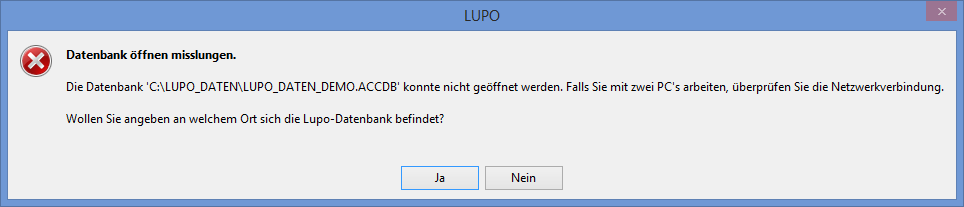
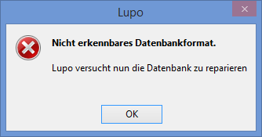
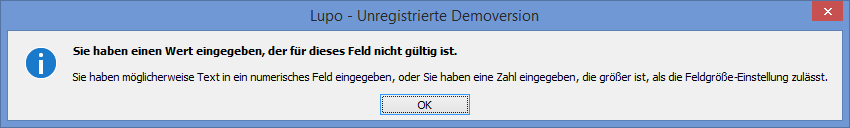
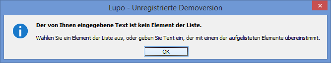
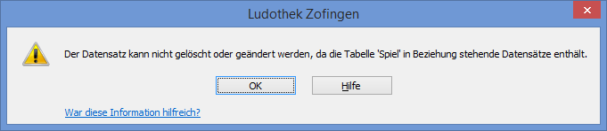
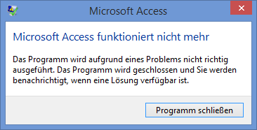
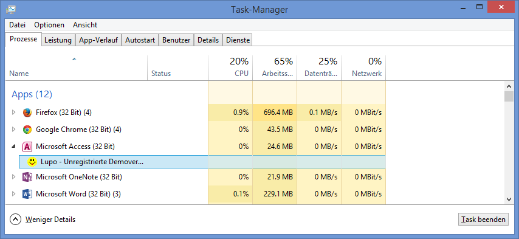

Falls eine Fehlermeldung erscheint, das LUPO-Programm abstürzt, ein Blue-Screen erscheint oder der PC unsanft durch einen Stromausfall abgeschaltet wird gehen keine Daten verloren. (Lediglich die letzte Eingabe ist ev. nicht gespeichert)

Nachfolgend finden sie einige bekannte oder gängige Probleme sowie passende Lösungsvorschläge.

#### Sicherheitsmeldung beim Start

Beim Start von LUPO oder einem anderen LUPO-Programm (z.B. dem Datenupdate-Programm) erscheint folgende Meldung oben im Fenster:

LUPO wurde unter einem anderen Benutzer installiert als der aktuell angemeldete. Führen Sie das Programm **LUPO Installation reparieren** unter dem aktuellen Benutzer aus um den Inhalt dauerhaft zu aktivieren.

#### Datenbank nicht gefunden

Sofort nach dem Start von LUPO erscheint diese Fehlermeldung:

LUPO kann die Daten-Datenbank (die Datei, in welcher alle Daten wie Adressen, Spiele, Ausleihen usw. gespeichert sind) nicht öffnen. Normalerweise ist diese Datei unter C:Lupo_DatenLupo10_Daten.accdb auf dem Haupt-PC und unter Z:Lupo10_Daten.accdb auf dem Netzwerk-PC gespeichert. Wenn die Meldung auf dem PC erscheint, welcher via Netzwerk auf den anderen zugreifen soll überprüfen Sie ob im Windows-Explorer das Netzlaufwerk (Z:) angezeigt wird und ob Sie darauf zugreifen können.

#### Nicht erkennbares Datenbankformat

Diese Fehlermeldung erscheint wenn die LUPO-Datendatei beschädigt ist. Dies kann z. B. geschehen wenn der PC abstürzt oder abgeschaltet wurde ohne herunterzufahren. Klicken Sie auf OK und im nächsten Dateiauswahl-Fenster auf Öffnen . Wenn LUPO danach ohne weitere Fehlermeldungen startet hat das Reparieren funktioniert und Sie können normal weiterarbeiten.

#### Unzulässiger Wert

Sie haben z.B. einen Buchstaben in ein Zahlenfeld eingegeben. Bestätigen Sie die Fehlermeldung und korrigieren Sie den Feldinhalt auf einen gültigen Wert oder drücken Sie [ESC] um Ihre Eingabe rückgängig zu machen und das Feld zu verlassen.

#### Kein Wert aus der Auswahlliste

Sie haben in einer Auswahlliste einen Wert eingegeben der nicht in der Liste vorkommt. Bestätigen Sie die Fehlermeldung und wählen Sie ein Element aus der Liste oder drücken Sie [ESC] um das Feld zu verlassen.

#### Datensatz löschen geht nicht

Sie versuchen einen Datensatz zu löschen, z.B. eine Spielkategorie in den Einstellungen, welcher noch einem anderen Datensatz zugeordnet ist. Heben Sie zuerst alle Verknüpfungen zu diesem Datensatz auf.

#### Schwarzer Bildschirm

Überprüfen Sie ob der Bildschirm am Strom und am PC angeschlossen ist. Schalten Sie den Bildschirm aus und wieder an.

#### Tastatur oder Maus geht nicht

Überprüfen sie ob das Kabel des betreffenden Geräts am Computer richtig angeschlossen ist. (Mag zwar blöd klingen, ist jedoch meistens die Ursache des Problems)

#### Druckerprobleme

Wenn Sie nicht Drucken können, überprüfen Sie ob der Drucker auf ON-LINE steht, Papier vorhanden ist und keine Fehlermeldung (rotes Lämpchen oder so) am Drucker angezeigt wird. Stellen Sie sicher, dass der Drucker richtig am Computer angeschlossen ist.

Überprüfen Sie ob Ihr Drucker als Standarddrucker definiert ist (Windows Systemsteuerung  Drucker und Geräte).

Probieren Sie, ob das Drucken aus einem anderen Programm funktioniert (z.B. Word)

#### Programm Absturz

Bill Gates lässt grüssen... Drücken Sie auf Programm schliessen und starten Sie LUPO neu.

#### Task-Manager ([Ctrl]+[Alt]+[Esc])

Falls LUPO überhaupt nicht mehr reagiert oder Sie eine Fehlermeldung oder ein Fenster nicht wegbringen, dann kann LUPO mit dem Task-Manager geschlossen werden. Drücken Sie dazu gleichzeitig die Tasten [Ctrl]+[Alt]+[Esc] oder klicken Sie mit der rechten Maustaste auf die Uhr im Bildschirm unten rechts um den Windows Task-Manager zu öffnen.

Zuerst markieren Sie LUPO in der Liste der laufenden Anwendungen, dann klicken Sie auf Task beenden , danach auf Sofort beenden .

#### Andere Fehlermeldungen

Erscheint eine komische Fehlermeldung, oder funktioniert es sonst nicht richtig, schliessen sie das Fenster und öffnen es erneut. Nützt dies nichts, schliessen Sie das LUPO-Programm und starten es erneut.

Falls die Fehlermeldung weiterhin besteht, dann können Sie uns ihre Datensicherungs-Datei schicken. Beschreiben Sie genau wann und wo der Fehler auftritt, so dass wir diesen reproduzieren können. Sobald der Fehler gefunden und behoben wurde kann ein Update auf unserer Website heruntergeladen werden.
