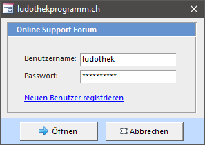

## Fernwartung mit TeamViewer

Zusammen mit LUPO wird die Software TeamViewer installiert, mit welcher von einem anderen Computer via Internetverbindung Ihr PC ferngesteuert werden kann.

[Direkter Download von teamviewer.com](https://get.teamviewer.com/ludothekprogramm)

Starten Sie den TeamViewer mit dem Desktop-Icon oder durch Drücken der Windows-Taste und anschliessendem Suchen nach TeamViewer oder direkt mit dem Symbolleistenbefehl im LUPO:

Bei aktivierter Benutzerkontensteuerung erscheint folgender Dialog, welcher mit Ja beantwortet werden muss:

Wenn das LUPO Quick-Support Fenster erscheint kann Ihr Support-Partner eine Verbindung zu Ihrem PC aufbauen.

Die Support-Verbindung zu Ihrem PC muss nun noch durch Sie bestätigt werden:

Nach erfolgter Verbindung können Sie sich zurücklehnen und zuschauen.

## LUPO-Forum

Hier kann der Benutzername und das Passwort für den Zugriff auf die online Frage-Antwort Datenbank definiert werden. Per Vorgabe sind die Werte für den Benutzer ludothek gesetzt. Wenn Sie sich auf unserer Website mit einem eigenen Benutzer registriert haben, können hier Ihre persönlichen Zugangsdaten eingetragen werden. Falls Sie noch keinen eingenen Benutzer haben empfehlen wir, dass Sie einen **[Neuen Benutzer registrieren](https://www.ludothekprogramm.ch/component/users/?view=registration)**.

## Online-Hilfe

Damit wird diese Online-Hilfe geöffnet.
