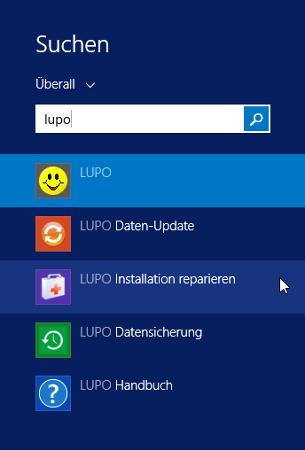
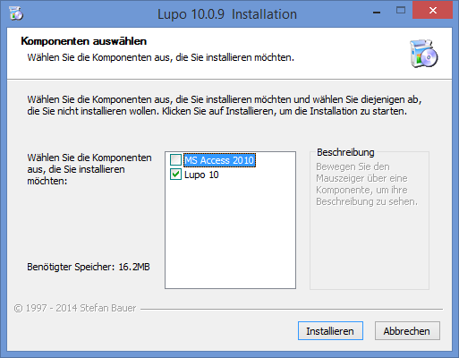

Wenn LUPO nicht mehr gestartet werden kann oder beim Start nur eine Fehlermeldung angezeigt wird, dann können Sie versuchen ob das Programm **LUPO Installation reparieren** das Problem behebt.

Öffnen Sie dieses durch Drücken der Windows-Taste und anschliessendem Suchen nach **LUPO**:

 
