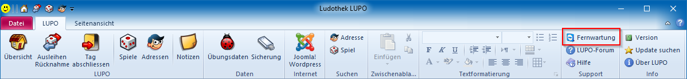
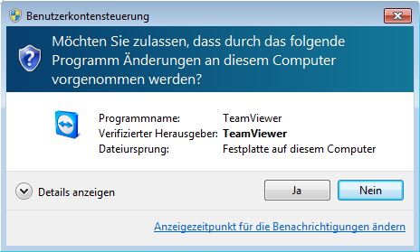
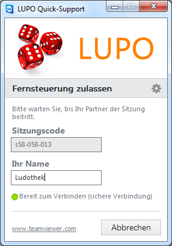
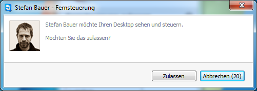

Zusammen mit LUPO wird die Software TeamViewer installiert, mit welcher von einem anderen Computer via Internetverbindung Ihr PC ferngesteuert werden kann.

Starten Sie den TeamViewer mit dem Desktop-Icon oder durch Drücken der Windows-Taste und anschliessendem Suchen nach TeamViewer oder direkt mit dem Symbolleistenbefehl im LUPO:

Bei aktivierter Benutzerkontensteuerung erscheint folgender Dialog, welcher mit Ja beantwortet werden muss:

Wenn das LUPO Quick-Support Fenster erscheint kann Ihr Support-Partner eine Verbindung zu Ihrem PC aufbauen.

Die Support-Verbindung zu Ihrem PC muss nun noch durch Sie bestätigt werden:

Nach erfolgter Verbindung können Sie sich zurücklehnen und zuschauen.