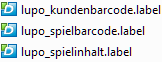
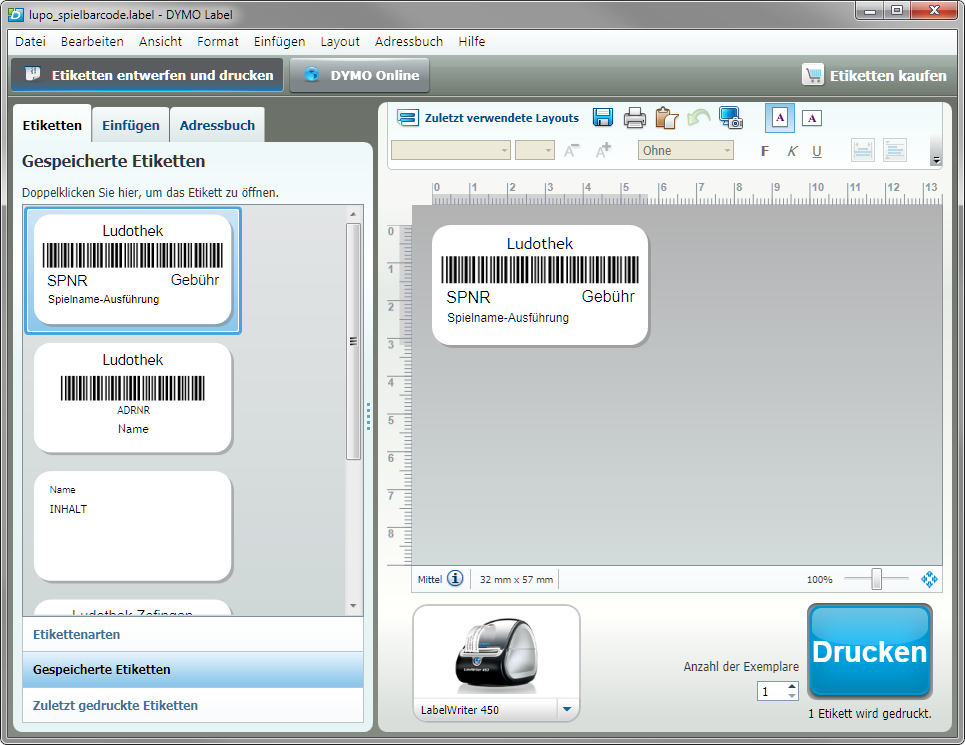
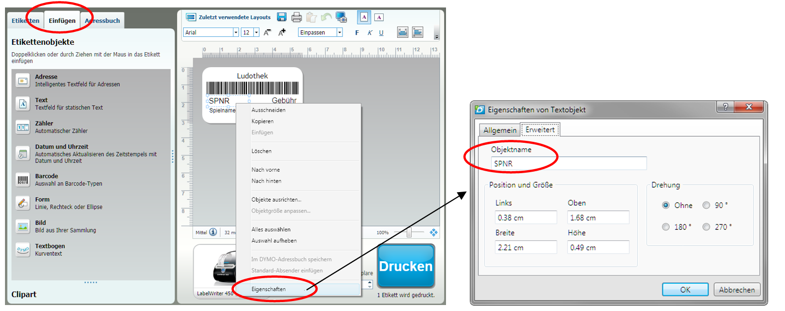
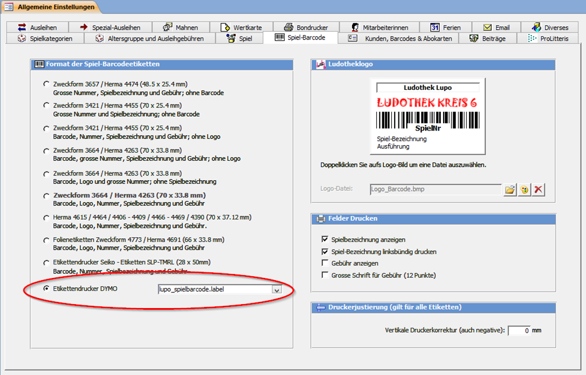
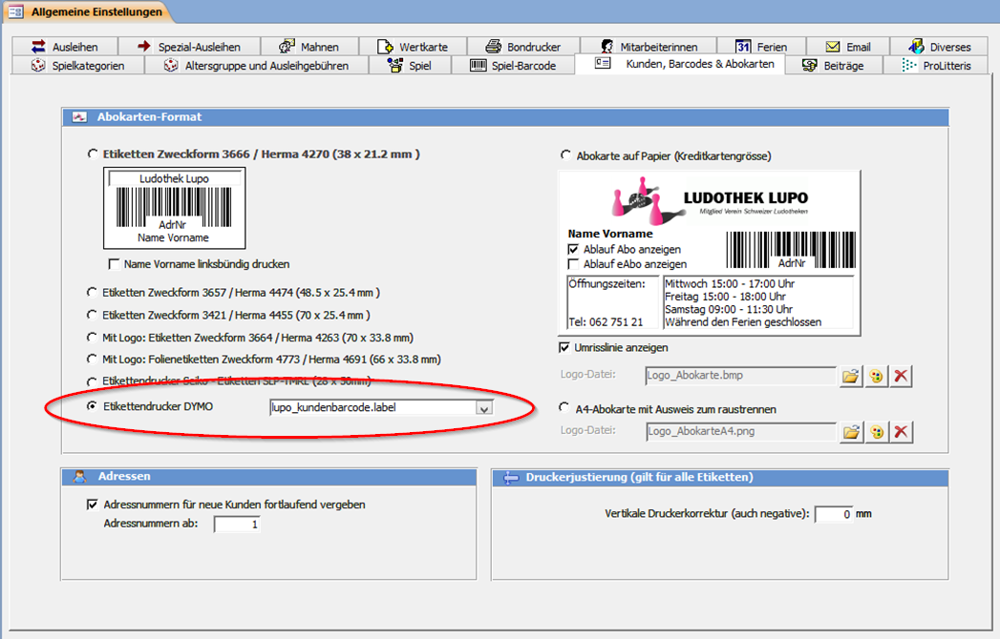
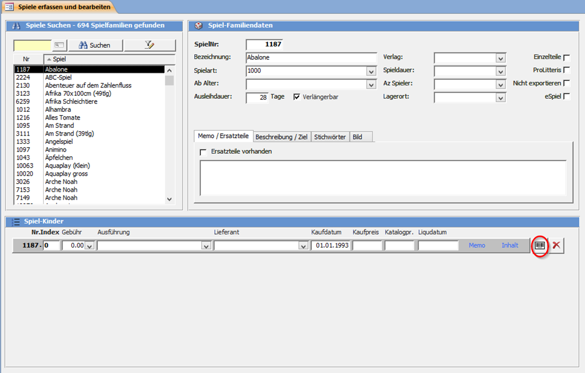
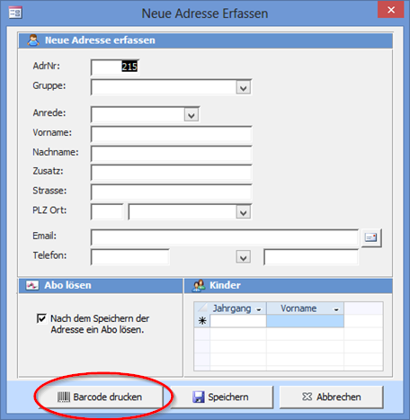

#### Druckertreiber und «DYMO Label v.8»-Software installieren

Installieren Sie – bevor Sie den Drucker am PC anschliessen – die Software mit der dem Drucker beigelegten CD. Eine Anleitung mit detaillierten Anweisungen liegt dem Drucker bei.

Bei der Installation von LUPO werden folgende drei Etiketten-Vorlagedateien in den Ordner C:Lupo_daten kopiert:

Dies sind alles Vorlagen der Etikettengrösse 32 mm x 57 mm (Art. N° 11354). Sie können selbstverständlich jedes beliebige andere Etikettenformat verwenden.

Öffnen Sie mit der DYMO Label v.8 Software eine Label-Datei:

Unter dem Reiter Einfügen können Sie frei Texte und Bilder dem Etikett hinzufügen oder bestehende Elemente anpassen.

#### Etiketten einrichten

Damit Lupo den Barcode oder Spielnamen mit Inhalt füllen kann müssen die Objekte mit dem korrekten Objektnamen versehen werden. Klicken Sie dazu im **Einfügen-Modus** mit der rechten Maustaste auf ein Objekt, dann wählen Sie **Eigenschaften**.

Gültige Objektnamen, welche von LUPO mit Inhalt gefüllt werden können

**Spiel-Barcode**

* LUDOTHEK
* BARCODE
* SPNR
* GEBÜHR
* SPIELNAME
* AUSFÜHRUNG
* SPIELNAME-AUSFÜHRUNG
* ART
* ARTKURZ
* ALTER
* LAGERORT
* INHALT
* LIEFERANT
* HERSTELLER
* AZSPIELER
* SPIELDAUER
* AUSLEIHTAGE
* KAUFPREIS
* KATALOGPREIS
* BESCHREIBUNG
* BESCHREIBUNG_TITEL

**Kunden-Barcode**
* LUDOTHEK
* BARCODE
* ADRNR
* VORNAME
* NACHNAME
* VORNAME_NACHNAME
* GRUPPE
* STRASSE
* PLZ
* ORT
* PLZ-ORT
* ABOENDDAT

#### LUPO-Einstellungen

Unter **Übersicht --> Einstellungen --> Programmeinstellungen** bei Spiel-Barcode den entsprechenden Etikettentyp sowie die Label-Datei wählen:

Und für die Kunden-Barcodes:

#### Einzelne Etikette drucken

Die Etikette eines Spiels kann durch Klicken auf den Barcode-Knopf in **Spiele Erfassen** Fenster gedruckt werden:

Im **Adressfenster** befindet sich hinter der Adressnummer ein Barcode-Knopf zum Drucken des Etiketts.

Ebenfalls kann im Fenster **Neue Adresse** direkt nach dem Eintippen der Adresse ein Etikett gedruckt werden:

!! Die DYMO-LabelWriter drucken mit dem Thermodirekt-Verfahren. Ein Nachteil von Thermopapier ist, dass die Etiketten mit der Zeit etwas verblassen. Hitze, direktes Sonnenlicht aber auch die Kunststoff-ausdunstung von Plastikfolien können diesen Prozess noch beschleunigen. Deshalb sollten die Etiketten nicht mit einer Schutzfolie überklebt werden.
