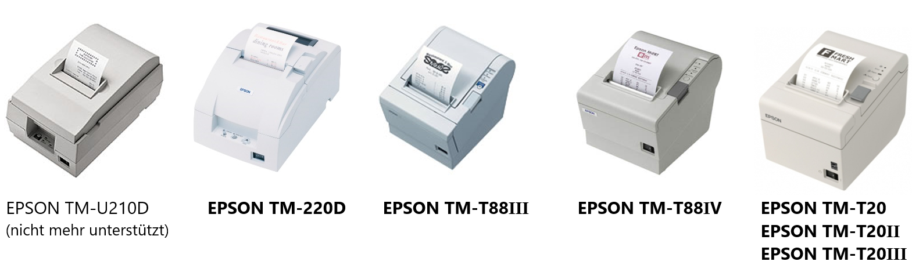

## EPSON Bondrucker installieren

Diese Installationsanleitung gilt für die EPSON-Drucker **TM-U220D / TM-T88III / TM-T88IV / TM-T20 / TM-T20II** Der Bondrucker wird direkt über die OPOS / UPOS Schnittstelle angesteuert und muss nicht als Windows-Drucker installiert werden. Es ist korrekt, wenn in der Systemsteuerung unter Geräte und Drucker der Bondrucker nicht aufgelistet ist.

#### EPSON OPOS ADK 2.80 installieren

Die Bondrucker-Software kann zusammen mit den LUPO-Programmdateien installiert werden. Wählen Sie dazu im LUPO Installationsassistent das Häkchen **EPSON Bondrucker** an:

Falls bereits eine aktuelle LUPO-Version installiert ist, dann kann das Programm zur Ansteuerung des Druckers auch von unserer Webseite heruntergeladen werden: 

>>>> **SetupPOS Version 2.5 oder älter **  
Wenn eine ältere Version des Bondrucker-Treibers installiert ist, z.B. für den TM-T210D Drucker, dann muss diese zuerst deinstalliert werden. Das «darüber installieren» der Version 2.8 funktioniert nicht.

.

>>>> **Windows Drucker**  
Der Drucker wird direkt aus LUPO über spezielle Drucker-Kommandos angesteuert. Es muss NICHT als Windows-Drucker (unter Drucker und Scanner) installiert werden.

#### Druckertreiber konfigurieren

Nach erfolgreicher Installation muss der Bondrucker konfiguriert werden. Starten Sie dazu das Programm **SetupPOS**( __ -Taste drücken, dann **SetupPOS** schreiben / suchen

Mit einem Klick auf das Symbol ganz links (Add New Device) öffnet sich folgendes Fenster. Wählen Sie **POSPrinter** als DeviceClass falls Sie danach gefragt werden.

1. **Ihr Druckermodell auswählen:** TM-U220D TM-T88III TM-T88IV TM-T20 TM-T20II
2. **Ihr Druckermodell schreiben:** TM-U220D TM-T88III TM-T88IV TM-T20 TM-T20II
3. **Weiter mit Next**

4\. **Drucker testen.** Öffnet ein Fenster zum Testen des Druckers. Werden beim Klicken auf **Start** einige Zeilen gedruckt, so ist der Druckertreiber korrekt installiert.

Wenn bei TMPORT Settings „(none)" steht, dann muss ein Port ausgewählt werden oder mit Make Port ein neuer erstellt werden. Mit Finish wird die Installation abgeschlossen.

#### LUPO konfigurieren

Nach der Installation und Konfiguration des Druckertreibers muss im LUPO unter **Übersicht --> Einstellungen --> Programmeinstellungen** noch das Druckermodell bestimmt werden. Wählen Sie dazu im Auswahlfeld POS-Printer Ihr Bondruckermodell (TM-U220D, TM-T88III, TM-T88IV, TM-T20 oder TM-T20II) aus.

Wenn im Netzwerk gearbeitet wird muss auf dem PC mit angeschlossenem Bondrucker das Häkchen An diesem Computer ist ein Bondrucker angeschlossen aktiviert sein. Die Option Drucken via Netzwerk aktivieren muss auf beiden Computern aktiviert sein. Der Druckertreiber (Setup-POS) muss nur auf dem PC, an welchem der Bondrucker angeschlossen ist, installiert werden.

#### Bondrucker-Modelle (EPSON)

Wenn Sie nicht sicher sind, welchen Bondrucker Sie verwenden, können Sie anhand der folgenden Bilder Ihr Druckermodell bestimmen:

